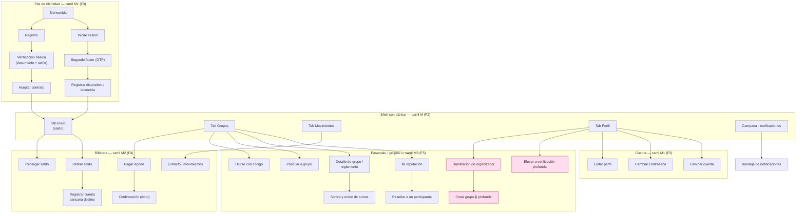

---
tags:
  - producto
  - frontend
  - flujo
  - pantallas
titulo: "Flujo de pantallas · app del participante"
fecha: 2026-08-18
alcance: apps/movil (Expo/React Native) · el recorrido de [[Flujo funcional · recorrido del usuario]] pantalla por pantalla
---

# Flujo de pantallas · app del participante

> **Qué es este documento.** El recorrido de [[Flujo funcional · recorrido del usuario]]
> traducido a **pantallas concretas** de `apps/movil` (Expo / React Native, Expo Router
> file-based). Cada pantalla dice: su ruta, qué organismos de `packages/ui` compone, sus
> cuatro estados, a dónde navega, qué RF/CU sirve, contra qué endpoint habla y **qué carril
> la construye** (`planes/16 · Carriles de frontend`).
>
> **Stack.** Front = **monorepo yarn workspaces orquestado con Turborepo** (yarn es el único
> gestor del proyecto; Turborepo corre y cachea `build`/`lint`/`test`); la app es
> **React Native (Expo SDK 54)** con
> **Expo Router** (una pantalla = un archivo, sin router central). Backend = microservicios
> **Spring Boot**, consumidos por el gateway a través del cliente generado `clientes/typescript`
> (nadie lo edita a mano). Ninguna pantalla habla con un servicio directo: todo pasa por la
> capa de dominio (`apps/movil/src/dominio/`) sobre el contrato OpenAPI.

## 0 · Reglas que valen para toda pantalla

1. **Los cuatro estados, siempre** (`planes/10 · Plan maestro del frontend` §regla 4). Toda pantalla
   con datos o dinero implementa y prueba: **cargando · vacío · error · éxito**. No hay
   pantalla de dinero sin sus cuatro estados.
2. **El dinero no se recalcula en el cliente.** Todo importe se muestra con el átomo `Monto`;
   el total, el saldo y la comisión vienen del backend (partida doble, `contabilidad-partida-doble`).
3. **Red intermitente.** Cada acción con efecto es idempotente desde el cliente (clave de
   idempotencia por gesto); un reintento no duplica (`idempotencia-reintentos`).
4. **El gate de acceso manda la navegación.** Verificación **básica** vs **profunda**
   (ver [[Flujo funcional · recorrido del usuario]] §0): las acciones que exigen nivel profundo
   (crear grupo) se muestran **deshabilitadas con motivo**, nunca ocultas — el usuario ve qué
   le falta y cómo conseguirlo.
5. **Sesión.** Un `401` en cualquier llamada dispara **un** intento de refresh contra
   `identidad` vía gateway; si falla, la app cae a la pila de identidad con la sesión cerrada
   ([[ADR-024 Autenticación y sesión distribuida]]).

## 1 · Mapa de navegación

> El bloque rosado exige **verificación profunda**. Todo lo demás corre con básica.

---

## 2 · Pila de identidad · carril **M1** (F3) · `apps/movil/src/pantallas/identidad/`

Sirve los RF-01, RF-02, RF-04, RF-14, RF-15, RF-16. CU 01–09.

### 2.1 · `identidad/bienvenida` — Bienvenida
- **RF:** entrada. **Compone:** organismo `PanelBienvenida` (logo, `Boton` primario "Crear
  cuenta", `Boton` secundario "Ya tengo cuenta").
- **Estados:** único (estática). **Navega a:** `registro` o `sesion`.

### 2.2 · `identidad/registro` — Crear cuenta (RF-01 · [[CU-01 Registro y apertura de billetera]])
- **Compone:** organismo `FormularioRegistro` (moléculas `CampoTexto`, `CampoTelefono`,
  `CampoCorreo`, `CampoContrasena` con medidor de fuerza; `Boton` "Continuar").
- **Estados:** vacío (form limpio) · cargando (enviando) · error (correo/teléfono ya usado →
  mensaje del código de error del CU) · éxito (pasa a verificación).
- **Endpoint:** `POST /usuarios` (servicio `identidad`). **Navega a:** `verificacion-basica`.

### 2.3 · `identidad/verificacion-basica` — Verificación básica (RF-01 · [[CU-01 Registro y apertura de billetera]])
- **Compone:** organismo `CapturaDocumento` (usa `expo-camera`: anverso, reverso, selfie de
  vivacidad; `ChipEstado` del progreso de cada captura).
- **Estados:** cargando (subiendo/validando) · error (documento ilegible → reintento) · éxito
  (nivel **básico** otorgado).
- **Endpoint:** `POST /usuarios/{id}/verificacion` (`identidad`). **Navega a:** `contrato`.

### 2.4 · `identidad/contrato` — Aceptar contrato de adhesión (RF-01 · [[CU-05 Aceptar contrato de adhesión y tarifario]])
- **Compone:** organismo `VisorContrato` (scroll con acuse al final; `Boton` "Acepto"
  habilitado solo tras leer; muestra el tarifario vigente leído del catálogo).
- **Estados:** cargando · error · éxito (alta firme, hash del contrato guardado).
- **Endpoint:** `POST /usuarios/{id}/contrato`. **Navega a:** shell (Tab Inicio).

### 2.5 · `identidad/sesion` — Iniciar sesión (RF-02 · [[CU-04 Autenticar con MFA y registrar dispositivo]])
- **Compone:** organismo `FormularioLogin` (`CampoCorreo`, `CampoContrasena`, `Boton`,
  enlace "Olvidé mi contraseña"). **Estados:** los cuatro (error = credencial inválida con
  rate limit visible). **Endpoint:** `POST /sesion`. **Navega a:** `mfa`.

### 2.6 · `identidad/mfa` — Segundo factor (RF-02 · [[CU-04 Autenticar con MFA y registrar dispositivo]])
- **Compone:** átomo `CampoOTP` (6 casillas) + `TecladoNumerico`; reenvío con cuenta regresiva.
- **Estados:** cargando · error (código vencido/incorrecto) · éxito. **Endpoint:** `POST /sesion/mfa`.
- **Navega a:** `dispositivo` (primer login) o shell.

### 2.7 · `identidad/dispositivo` — Registrar dispositivo / biometría (RF-02)
- **Compone:** organismo `RegistroDispositivo` (`expo-local-authentication`; `Boton` "Activar
  biometría"). **Estados:** éxito / omitir. **Endpoint:** `POST /sesion/dispositivos`.

### 2.8 · `identidad/verificacion-profunda` — Elevar verificación 🔒 (RF-04 · [[CU-02 Elevar nivel de debida diligencia]] · [[CU-03 Declaración PEP y beneficiario final]])
- **Compone:** organismo `FormularioKYCReforzado` (captura reforzada + molécula
  `DeclaracionPEP` con toggle y campos condicionales de beneficiario final).
- **Estados:** cargando · error · éxito (**nivel profundo**; se habilita "Crear grupo").
- **Endpoints:** `POST /usuarios/{id}/nivel`, `POST /usuarios/{id}/pep`.

### 2.9 · Cuenta — `identidad/perfil`, `identidad/contrasena`, `identidad/baja`
- **`perfil`** (RF-15 · [[CU-07 Ejercer derechos sobre datos personales]]): organismo
  `FormularioPerfil`; `PUT /usuarios/{id}`.
- **`contrasena`** (RF-14 · [[CU-09 Cambiar credenciales y solicitar la baja]]): organismo
  `FormularioCambioContrasena` (actual + nueva + confirmación; invalida otras sesiones);
  `POST /usuarios/{id}/contrasena`.
- **`baja`** (RF-16 · [[CU-09 Cambiar credenciales y solicitar la baja]] + [[CU-16 Cerrar billetera y devolver saldo]]):
  organismo `AsistenteBaja` — verifica saldo cero / lo devuelve primero, doble confirmación,
  explica la retención legal; `POST /usuarios/{id}/baja`.

---

## 3 · Shell de navegación · carril **M** (F2) · `apps/movil/src/navegacion/`

- **Tab bar** con cuatro destinos: **Inicio**, **Grupos**, **Movimientos**, **Perfil**
  (átomo/organismo `BarraPestanas`). **Campana** de notificaciones en la cabecera.
- **`ProveedorSesion`**: guarda el token en `expo-secure-store`, adjunta el bearer, ejecuta el
  `401 → refresh → reintento`, y expone el **nivel de verificación** para el gating de la UI.
- **Deep links** de Expo Router para invitaciones (`aportaya://unirse/{codigo}`) y para abrir
  una notificación en su pantalla.

---

## 4 · Billetera · carril **M2** (F4) · `apps/movil/src/pantallas/billetera/`

Sirve RF-07, RF-08, RF-09, RF-12. CU 10–19, 21.

### 4.1 · `billetera/inicio` — Inicio / saldo (Tab Inicio)
- **Compone:** organismo `TarjetaSaldo` (átomo `Monto`) + `AccesosRapidos` (Recargar,
  Retirar, Pagar) + `ListaMovimientos` (últimos 5). **Estados:** los cuatro.
- **Endpoint:** `GET /billetera/saldo`, `GET /billetera/movimientos?limite=5`.

### 4.2 · `billetera/recargar` — Cargar crédito (RF-07 · [[CU-10 Recargar saldo]])
- **Compone:** molécula `CampoMonto` + `TecladoNumerico` + selector de medio (QR / punto de
  atención); organismo `ResumenRecarga`. Al confirmar por QR abre `PantallaQR` con el código y
  su vencimiento. **Estados:** cargando (esperando confirmación del proveedor) · error · éxito
  (acreditado solo cuando el banco confirma). **Endpoint:** `POST /billetera/recargas`
  (la orden vive en `nucleo-financiero`; la cobranza por QR la resuelve `aportes` vía `/qr`).

### 4.3 · `billetera/retirar` — Retirar crédito (RF-09 · [[CU-11 Retirar saldo]])
- **Compone:** `CampoMonto` + selector de cuenta destino (`SelectorCuentaBancaria`); muestra
  el límite vigente leído del catálogo. **Estados:** los cuatro (error = sin cuenta verificada
  → CTA a `cuenta-bancaria`; o monto sobre el límite). **Endpoint:** `POST /billetera/retiros`.

### 4.4 · `billetera/cuenta-bancaria` — Registrar cuenta destino ([[CU-18 Registrar y verificar una cuenta bancaria de destino]])
- **Compone:** organismo `FormularioCuentaBancaria` (banco, tipo, número; micro-depósito de
  verificación). **Estados:** los cuatro. **Endpoint:** `POST /cuentas-bancarias`.

### 4.5 · `billetera/extracto` — Movimientos / extracto (Tab Movimientos · [[CU-15 Emitir extracto y certificado de saldo]])
- **Compone:** organismo `ListaMovimientos` (molécula `FilaMovimiento` con `ChipEstado`),
  filtros por fecha/tipo, `Boton` "Exportar/Certificado". **Estados:** los cuatro (vacío = "aún
  no hay movimientos"). **Endpoint:** `GET /billetera/movimientos`, `POST /billetera/certificado`.

### 4.6 · `billetera/pagar-aporte` — Pagar el aporte (RF-08 · [[CU-21 Cobrar el aporte del período]])
- **Compone:** organismo `FormularioAporte` (molécula `FilaAporte`, `CampoMonto` bloqueado al
  monto del aporte, resumen con comisión del catálogo). **Es una saga (S1)**: la pantalla
  muestra un estado **"procesando"** mientras la saga confirma los tres pasos; si compensa,
  la UI vuelve a "pendiente" con el motivo. **Estados:** cargando/procesando · error
  (compensada) · éxito. **Endpoint:** `POST /aportes/{id}/pago`.

### 4.7 · `billetera/confirmacion` — Confirmación (RF-12)
- **Compone:** organismo `PantallaResultado` (ícono de éxito, `Monto`, comprobante,
  `Boton` "Compartir comprobante"). Es el estado **éxito** canónico reutilizable.

---

## 5 · Pasanaku / grupos · carril **M3** (F5) · `apps/movil/src/pantallas/pasanaku/`

Sirve RF-03, RF-05, RF-06, RF-10, RF-13. CU 20–29, 60, 61, 68–76, 90.

### 5.1 · `pasanaku/unirse` — Unirse con código (RF-03 · [[CU-69 Invitar a un contacto y registrar sus referencias]])
- **Compone:** organismo `CanjearInvitacion` (`CampoCodigo` o llegada por deep link; muestra
  el grupo, su reglamento y el cupo). **Estados:** cargando · error (código usado/vencido) ·
  éxito (participante con cupo). **Endpoint:** `POST /grupos/invitaciones/{codigo}/canje`.

### 5.2 · `pasanaku/postular` — Postular a grupo (RF-03 · [[CU-68 Postular a un grupo y ser emparejado]])
- **Compone:** organismo `FormularioPostulacion` (preferencias; muestra el puntaje explicable).
  **Estados:** los cuatro. **Endpoint:** `POST /grupos/postulaciones`.

### 5.3 · `pasanaku/grupo/[codigo]` — Detalle de grupo
- **Compone:** organismo `TarjetaGrupo` + `ListaParticipantes` + `ReglamentoGrupo` +
  `CalendarioTurnos`. **Estados:** los cuatro. **Endpoint:** `GET /grupos/{codigo}`.
- **Navega a:** `sorteo`, `pagar-aporte`.

### 5.4 · `pasanaku/organizador` — Habilitación de organizador 🔒 (RF-05 · [[CU-90 Postular a organizador y habilitarse]])
- **Precondición de UI:** nivel **profundo**; si no, muestra CTA a `verificacion-profunda`.
- **Compone:** organismo `AsistenteOrganizador` (requisitos, capacitación con vigencia, firma
  del contrato). **Endpoint:** `POST /organizadores/postulaciones`.

### 5.5 · `pasanaku/crear` — Crear grupo 🔒 (RF-06 · [[CU-20 Crear grupo y congelar tarifario]])
- **Precondición de UI:** organizador habilitado. Si el usuario no lo es, la acción aparece
  **deshabilitada con motivo** (gate del §0.4).
- **Compone:** organismo `FormularioGrupo` (nombre, cupos, monto, frecuencia; el tarifario
  vigente se **congela** al crear). **Estados:** los cuatro. **Endpoint:** `POST /grupos`.

### 5.6 · `pasanaku/sorteo` — Sorteo y orden de turnos (RF-10 · [[CU-60 Sortear los turnos]] · [[CU-61 Verificar públicamente el sorteo]])
- **Compone:** organismo `PanelSorteo` (semilla y prueba de verificación; `ListaTurnos` con el
  orden sellado; enlace a la verificación pública en `apps/web`). **Estados:** cargando ·
  vacío (aún no sorteado) · éxito. **Endpoint:** `GET /grupos/{codigo}/sorteo`.

### 5.7 · `pasanaku/reputacion` — Mi reputación (RF-13 · [[CU-71 Recalcular el puntaje de reputación]])
- **Compone:** organismo `TarjetaReputacion` (puntaje con factores explicables) +
  `ListaReseñas` (molécula `FilaReseña` con `EstrellasCalificacion`). **Estados:** los cuatro.
  **Endpoint:** `GET /reputacion/usuarios/{id}`.

### 5.8 · `pasanaku/reseñar` — Reseñar a un participante ([[CU-76 Reseñar a un participante y moderar la reseña]])
- **Compone:** organismo `FormularioReseña` (`EstrellasCalificacion`, texto moderado).
  **Estados:** los cuatro. **Endpoint:** `POST /reputacion/reseñas`.

---

## 6 · Notificaciones · carril **M** (shell) · `apps/movil/src/pantallas/notificaciones/`

Sirve RF-11, RF-12. CU 80, 81.

### 6.1 · `notificaciones/bandeja` — Bandeja
- **Compone:** organismo `BandejaNotificaciones` (molécula `FilaNotificacion` con `ChipEstado`
  leído/no leído; recordatorios de aporte con CTA "Pagar" → `billetera/pagar-aporte`).
- **Estados:** los cuatro (vacío = "estás al día"). **Endpoint:** `GET /notificaciones`.
- **Recibe** el push que dispara [[CU-80 Despachar una notificación]]; los recordatorios los
  programa [[CU-81 Programar recordatorios de aporte]] en el backend.

---

## 7 · Inventario de organismos que el sistema de diseño debe entregar

Estos organismos los **construye F1** en `packages/ui` (los transversales) o los shells de cada
dominio (los específicos), y los carriles M1/M2/M3 solo los **componen**. Entra al alcance de
`planes/11 · Fases F0 y F1`.

| Organismo | Dominio | Carril que lo consume | Átomos/moléculas clave |
| --- | --- | --- | --- |
| `PanelBienvenida`, `FormularioRegistro`, `CapturaDocumento`, `VisorContrato` | identidad | M1 (F3) | `Boton`, `Campo*`, `ChipEstado`, `expo-camera` |
| `FormularioLogin`, `CampoOTP`, `RegistroDispositivo` | identidad | M1 (F3) | `TecladoNumerico`, `expo-local-authentication` |
| `FormularioKYCReforzado`, `DeclaracionPEP` | identidad | M1 (F3) | `Campo*`, toggles condicionales |
| `FormularioPerfil`, `FormularioCambioContrasena`, `AsistenteBaja` | identidad | M1 (F3) | `Campo*`, doble confirmación |
| `TarjetaSaldo`, `AccesosRapidos`, `ListaMovimientos` (`FilaMovimiento`) | billetera | M2 (F4) | `Monto`, `ChipEstado` |
| `CampoMonto`, `ResumenRecarga`, `PantallaQR` | billetera | M2 (F4) | `TecladoNumerico`, `expo-camera` |
| `FormularioCuentaBancaria`, `SelectorCuentaBancaria` | billetera | M2 (F4) | `Campo*` |
| `FormularioAporte` (`FilaAporte`), `PantallaResultado` | billetera | M2 (F4) | `Monto` |
| `CanjearInvitacion`, `FormularioPostulacion`, `TarjetaGrupo`, `ReglamentoGrupo` | pasanaku | M3 (F5) | `CampoCodigo`, `ChipEstado` |
| `AsistenteOrganizador`, `FormularioGrupo` | pasanaku | M3 (F5) | `Campo*` (gated) |
| `PanelSorteo` (`ListaTurnos`), `TarjetaReputacion`, `FormularioReseña` (`EstrellasCalificacion`) | pasanaku | M3 (F5) | — |
| `BandejaNotificaciones` (`FilaNotificacion`), `BarraPestanas` | shell | M (F2) | `ChipEstado`, `Avatar` |

**Regla de subida** (`planes/10 · Plan maestro del frontend` §"lo que sirve a dos productos sube a
`packages/ui`"): los átomos y las moléculas transversales (`Boton`, `Campo*`, `Monto`,
`ChipEstado`, `TecladoNumerico`, `CampoOTP`, `EstrellasCalificacion`, `ChipEstado`) viven en
`packages/ui`; lo que depende de una API nativa (cámara, biometría) se queda en `apps/movil`.

## Ver también

[[Flujo funcional · recorrido del usuario]] · `planes/16 · Carriles de frontend` ·
`planes/11 · Fases F0 y F1` · `planes/10 · Plan maestro del frontend` ·
[[ADR-004 Frontend]] · `disenar-frontend` · `movil-expo` · `arquitectura-atomica`
