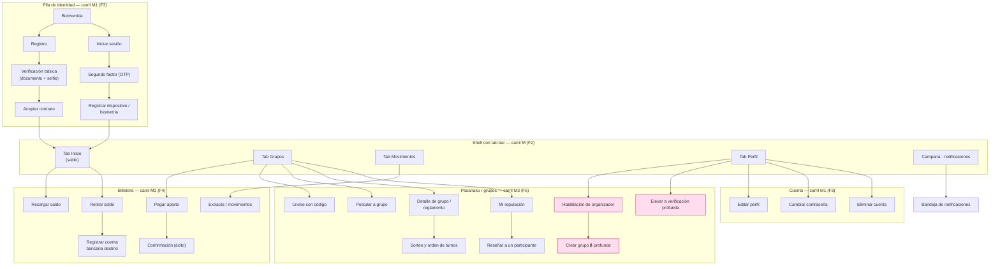

---
tags:
  - producto
  - frontend
  - flujo
  - pantallas
titulo: "Flujo de pantallas · app del participante"
fecha: 2026-08-18
alcance: apps/movil (Expo/React Native) · el recorrido de [[Flujo funcional · recorrido del usuario]] pantalla por pantalla
---

# Flujo de pantallas · app del participante

> ⛔ **Antes de implementar algo de este documento, leé y obedecé
> [[Contrato de implementación para IA]].** No inventes rutas, organismos, endpoints ni campos:
> solo existe lo listado acá o en una fuente de verdad; lo demás es **hueco**, no relleno.

> **Qué es este documento.** El recorrido de [[Flujo funcional · recorrido del usuario]]
> traducido a **pantallas concretas** de `apps/movil` (Expo / React Native, Expo Router
> file-based). Cada pantalla dice: su ruta, qué organismos de `packages/ui` compone, sus
> cuatro estados, a dónde navega, qué RF/CU sirve, contra qué endpoint habla y **qué carril
> la construye** (`planes/16 · Carriles de frontend`).
>
> **Stack.** Front = **monorepo yarn workspaces orquestado con Turborepo** (yarn es el único
> gestor del proyecto; Turborepo corre y cachea `build`/`lint`/`test`); la app es
> **React Native (Expo SDK 54)** con
> **Expo Router** (una pantalla = un archivo, sin router central). Backend = microservicios
> **Spring Boot**, consumidos por el gateway a través del cliente generado `clientes/typescript`
> (nadie lo edita a mano). Ninguna pantalla habla con un servicio directo: todo pasa por la
> capa de dominio (`apps/movil/src/dominio/`) sobre el contrato OpenAPI.

## 0 · Reglas que valen para toda pantalla

1. **Los cuatro estados, siempre** (`planes/10 · Plan maestro del frontend` §regla 4). Toda pantalla
   con datos o dinero implementa y prueba: **cargando · vacío · error · éxito**. No hay
   pantalla de dinero sin sus cuatro estados.
2. **El dinero no se recalcula en el cliente.** Todo importe se muestra con el átomo `Monto`;
   el total, el saldo y la comisión vienen del backend (partida doble, `contabilidad-partida-doble`).
2b. **El saldo se vuelve a leer, nunca se ajusta en memoria.** Después de **toda** operación con
   efecto —recarga acreditada, aporte pagado, retiro solicitado— la app hace `GET /billetera/saldo`
   otra vez. **Está prohibido** sumar o restar el monto sobre el saldo que ya tenía en pantalla:
   el saldo no se guarda en ninguna parte, se **deriva** del libro append-only, y una resta hecha
   en el cliente es una cifra que nadie puede reconstruir después. El mismo criterio para la lista
   de movimientos: se relee, no se le empuja la fila nueva a mano.
   **Y el saldo no cambia antes de tiempo**: una recarga por QR se acredita cuando el proveedor
   confirma, no cuando el usuario dice que pagó ([[CU-10 Recargar saldo]]).
3. **Red intermitente.** Cada acción con efecto es idempotente desde el cliente (clave de
   idempotencia por gesto); un reintento no duplica (`idempotencia-reintentos`).
4. **El gate de acceso manda la navegación.** Verificación **básica** vs **profunda**
   (ver [[Flujo funcional · recorrido del usuario]] §0): las acciones que exigen nivel profundo
   (crear grupo) se muestran **deshabilitadas con motivo**, nunca ocultas — el usuario ve qué
   le falta y cómo conseguirlo.
5. **Sesión.** Un `401` en cualquier llamada dispara **un** intento de refresh contra
   `identidad` vía gateway; si falla, la app cae a la pila de identidad con la sesión cerrada
   ([[ADR-024 Autenticación y sesión distribuida]]).
6. **CRUD sobre lo propio, con soft delete.** El participante administra sus recursos con el
   ciclo completo — **crear, listar/ver, editar y dar de baja** — sobre lo que le pertenece:
   cuentas bancarias de destino, dispositivos de confianza, reclamos, preferencias y perfil.
   **Borrar siempre es _soft delete_** (baja lógica: estado + fecha, el registro queda): nunca
   un `DELETE` físico. Y lo **financiero no se borra jamás** — saldo, movimientos, aportes y
   asientos son append-only; un movimiento no se elimina, se explica o se reversa.

## 1 · Mapa de navegación

> El bloque rosado exige **verificación profunda**. Todo lo demás corre con básica.

---

## 2 · Pila de identidad · carril **M1** (F3) · `apps/movil/src/pantallas/identidad/`

Sirve los RF-01, RF-02, RF-04, RF-14, RF-15, RF-16. CU 01–09.

### 2.1 · `identidad/bienvenida` — Bienvenida
- **RF:** entrada. **Compone:** organismo `PanelBienvenida` (logo, `Boton` primario "Crear
  cuenta", `Boton` secundario "Ya tengo cuenta").
- **Estados:** único (estática). **Navega a:** `registro` o `sesion`.

### 2.2 · `identidad/registro` — Crear cuenta (RF-01 · [[CU-01 Registro y apertura de billetera]])
- **Compone:** organismo `FormularioRegistro` (moléculas `CampoTexto`, `CampoTelefono`,
  `CampoCorreo`, `CampoContrasena` con medidor de fuerza; `Boton` "Continuar").
- **Estados:** vacío (form limpio) · cargando (enviando) · error (correo/teléfono ya usado →
  mensaje del código de error del CU) · éxito (pasa a verificación).
- **Endpoint:** `POST /usuarios` (servicio `identidad`). **Navega a:** `verificacion-basica`.

### 2.3 · `identidad/verificacion-basica` — Verificación básica (RF-01 · [[CU-01 Registro y apertura de billetera]])
- **Compone:** organismo `CapturaDocumento` (usa `expo-camera`: anverso, reverso, selfie de
  vivacidad; `ChipEstado` del progreso de cada captura).
- **Estados:** cargando (subiendo/validando) · error (documento ilegible → reintento) · éxito
  (nivel **básico** otorgado).
- **Endpoint:** `POST /usuarios/{id}/verificacion` (`identidad`). **Navega a:** `contrato`.

### 2.4 · `identidad/contrato` — Aceptar contrato de adhesión (RF-01 · [[CU-05 Aceptar contrato de adhesión y tarifario]])
- **Compone:** organismo `VisorContrato` (scroll con acuse al final; `Boton` "Acepto"
  habilitado solo tras leer; muestra el tarifario vigente leído del catálogo).
- **Estados:** cargando · error · éxito (alta firme, hash del contrato guardado).
- **Endpoint:** `POST /usuarios/{id}/contrato`. **Navega a:** shell (Tab Inicio).

### 2.5 · `identidad/sesion` — Iniciar sesión (RF-02 · [[CU-04 Autenticar con MFA y registrar dispositivo]])
- **Compone:** organismo `FormularioLogin` (`CampoCorreo`, `CampoContrasena`, `Boton`,
  enlace "Olvidé mi contraseña"). **Estados:** los cuatro (error = credencial inválida con
  rate limit visible). **Endpoint:** `POST /sesion`. **Navega a:** `mfa`.

### 2.6 · `identidad/mfa` — Segundo factor (RF-02 · [[CU-04 Autenticar con MFA y registrar dispositivo]])
- **Compone:** átomo `CampoOTP` (6 casillas) + `TecladoNumerico`; reenvío con cuenta regresiva.
- **Estados:** cargando · error (código vencido/incorrecto) · éxito. **Endpoint:** `POST /sesion/mfa`.
- **Navega a:** `dispositivo` (primer login) o shell.

### 2.7 · `identidad/dispositivos` — Dispositivos de confianza (CRUD · RF-02)
- **Registrar** — organismo `RegistroDispositivo` (`expo-local-authentication`; `Boton`
  "Activar biometría"). `POST /sesion/dispositivos`.
- **Listar/ver** — `ListaDispositivos` (nombre, último acceso, actual). `GET /sesion/dispositivos`.
- **Editar** — renombrar el dispositivo. `PATCH /sesion/dispositivos/{id}`.
- **Revocar (soft delete)** — desvincula un dispositivo perdido; sus sesiones se invalidan.
  `DELETE /sesion/dispositivos/{id}`.
- **Estados:** los cuatro.

### 2.8 · `identidad/verificacion-profunda` — Elevar verificación 🔒 (RF-04 · [[CU-02 Elevar nivel de debida diligencia]] · [[CU-03 Declaración PEP y beneficiario final]])
- **Compone:** organismo `FormularioKYCReforzado` (captura reforzada + molécula
  `DeclaracionPEP` con toggle y campos condicionales de beneficiario final).
- **Estados:** cargando · error · éxito (**nivel profundo**; se habilita "Crear grupo").
- **Endpoints:** `POST /usuarios/{id}/nivel`, `POST /usuarios/{id}/pep`.

### 2.9 · Cuenta — `identidad/perfil`, `identidad/contrasena`, `identidad/baja`
- **`perfil`** (RF-15 · [[CU-07 Ejercer derechos sobre datos personales]]): organismo
  `FormularioPerfil`; `PUT /usuarios/{id}`.
- **`contrasena`** (RF-14 · [[CU-09 Cambiar credenciales y solicitar la baja]]): organismo
  `FormularioCambioContrasena` (actual + nueva + confirmación; invalida otras sesiones);
  `POST /usuarios/{id}/contrasena`.
- **`baja`** (RF-16 · [[CU-09 Cambiar credenciales y solicitar la baja]] + [[CU-16 Cerrar billetera y devolver saldo]]):
  organismo `AsistenteBaja` — verifica saldo cero / lo devuelve primero, doble confirmación,
  explica la retención legal; `POST /usuarios/{id}/baja`.

---

## 3 · Shell de navegación · carril **M** (F2) · `apps/movil/src/navegacion/`

- **Tab bar** con cuatro destinos y **solo cuatro**: **Inicio**, **Grupos**, **Movimientos**,
  **Perfil** (átomo/organismo `BarraPestanas`). **Avisos no es una pestaña**: se llega por la
  **campana** de la cabecera, con punto de color cuando hay algo sin leer. Una quinta pestaña
  para la bandeja le quitaría peso a las cuatro que sostienen el producto.
- **`ProveedorSesion`**: guarda el token en `expo-secure-store`, adjunta el bearer, ejecuta el
  `401 → refresh → reintento`, y expone el **nivel de verificación** para el gating de la UI.
- **Deep links** de Expo Router para invitaciones (`aportaya://unirse/{codigo}`) y para abrir
  una notificación en su pantalla.

---

## 4 · Billetera · carril **M2** (F4) · `apps/movil/src/pantallas/billetera/`

Sirve RF-07, RF-08, RF-09, RF-12. CU 10–19, 21.

### 4.1 · `billetera/inicio` — Inicio / saldo (Tab Inicio)
- **Compone:** organismo `TarjetaSaldo` (átomo `Monto`) + `AccesosRapidos` (**Recargar** y
  **Retirar**, dos y nada más) + `ListaMovimientos` (últimos 5). **Estados:** los cuatro.
- **Endpoint:** `GET /billetera/saldo`, `GET /billetera/movimientos?limite=5`.
- **Pagar el aporte NO es un acceso rápido.** Es el llamado a la acción **principal** de la
  pantalla y vive en la `TarjetaSaldo` como el único botón naranja, más su entrada desde el
  detalle del grupo. Tres accesos rápidos con el mismo peso escondían la acción que de verdad
  importa, y el sistema de diseño ya decía **Recargar / Retirar** para la tarjeta de saldo móvil
  (`docs/Views/Sistema-Diseno/Moviles/Moviles.md`): la que estaba desalineada era esta lista.
  Un solo naranja por pantalla (`disenar-frontend` §6).

### 4.2 · `billetera/recargar` — Cargar crédito (RF-07 · [[CU-10 Recargar saldo]])
- **Compone:** molécula `CampoMonto` + `TecladoNumerico` + organismo `ResumenRecarga`.
- **El único medio de recarga en la app es el QR. No hay selector de medio.** La propuesta de
  valor es evitarle complicaciones a la persona, y ofrecerle «andá a un punto con efectivo» es
  exactamente la complicación que el producto viene a sacar. Sin filas, sin horarios y sin
  manipular billetes. Además, el efectivo es el medio que arrastra el umbral PCC-01 de la UIF,
  el arqueo de caja y el faltante de caja como evento de riesgo: no ofrecerlo en la app le quita
  al producto una superficie entera de cumplimiento y de fraude.
- **El efectivo salió del producto, no solo de la pantalla.**
  [[ADR-039 Sin efectivo · la plataforma no opera dinero físico]] retiró del modelo
  `punto_atencion` y `arqueo_punto_atencion`, dejó [[CU-57 Operar un punto de atención y arquear el efectivo]]
  obsoleto y sacó `AGENTE` del alcance de licencia sembrado. Ya no es un hueco: es una decisión
  tomada, con su costo escrito —se pierde a quien no está bancarizado— y su compensación —la
  interoperabilidad del QR que exige el reglamento del BCB—.
- **`PantallaQR` muestra cuatro cosas y ninguna más**: el código, el monto, la **orden** a la que
  pertenece y su **vencimiento con cuenta regresiva**. El payload EMV y `expiraEn` los devuelve
  `SalidaCU10.qr`; el cliente no arma el código.
- **El saldo no se mueve mientras el QR está en pantalla.** Se acredita cuando llega la
  confirmación del proveedor, y recién ahí la app relee el saldo (§0.2b). Acreditar contra la
  promesa del usuario sería prestarle plata, y la pantalla lo dice con esas palabras.
- **Al acreditarse**: snackbar de confirmación con el monto, y el movimiento aparece en el
  extracto en la relectura, no empujado a mano.
- **Rechazo típico:** `AP-CU10-01 LIMITE_EXCEDIDO`, con la salida ofrecida (elevar el nivel de
  verificación), nunca un error a secas.

### 4.3 · `billetera/retirar` — Retirar crédito (RF-09 · [[CU-11 Retirar saldo]])
- **La pantalla pide dos cosas, en este orden: el monto y la cuenta donde depositarlo.**
  Compone `CampoMonto` (con el disponible y el costo de retiro a la vista) +
  `SelectorCuentaBancaria`, y **si el usuario todavía no tiene cuenta registrada, la agrega desde
  acá mismo** con `FormularioCuentaBancaria` —banco, tipo y número—, sin mandarlo a otra pantalla
  a buscarla. **Endpoint:** `POST /billetera/retiros`.
- **El número de cuenta se escribe una vez y nunca más se ve entero.** Se cifra antes de tocar
  disco; la pantalla muestra `numero_enmascarado` (`••••4321`). El número en claro no se
  persiste, no entra a la bitácora y no viaja en ningún aviso (`R-SEG-01`,
  [[CU-18 Registrar y verificar una cuenta bancaria de destino]]).
- **La cuenta tiene que ser del titular.** Se compara `titular_documento` contra el documento de
  quien retira; si no coinciden **no se registra**. No se retira a cuentas de terceros, y el
  formulario lo dice antes de que la persona escriba.
- **Una cuenta recién agregada no cobra el mismo minuto.** Queda `EN_VERIFICACION` (micro-depósito,
  consulta al proveedor o comprobante) y después en **ventana de enfriamiento**. Si se intenta
  retirar hacia ella, el rechazo es `AP-CU11-03 INSTRUMENTO_EN_ENFRIAMIENTO`, y la pantalla lo
  explica en lenguaje humano en vez de mostrar el código pelado. Esta ventana es lo que corta el
  patrón «me tomaron la cuenta y vaciaron la billetera», y es la misma condición que el motor
  antifraude vigila con `RETIRO_INSTRUMENTO_NUEVO`.
- **Un retiro siempre exige segundo factor** (`R-BIL-09`, `AP-CU11-02`).
- **Estados:** los cuatro. Errores esperables: `AP-CU11-01 SALDO_INSUFICIENTE` (el disponible no
  cubre monto **más** costo), `AP-CU11-03`, `AP-CU11-04 TITULAR_NO_COINCIDE`.
- **Al confirmar:** el saldo se relee (§0.2b), aparece el movimiento con estado *en proceso*
  —el dinero sale cuando Tesorería ejecuta la orden ([[CU-28 Emitir la orden de desembolso y ejecutar el intento]])—
  y se muestra un snackbar con el monto y la cuenta enmascarada.

### 4.4 · `billetera/cuentas-bancarias` — Mis cuentas de destino (CRUD · [[CU-18 Registrar y verificar una cuenta bancaria de destino]])
- **CRUD completo sobre lo propio:**
  - **Listar/ver** — organismo `ListaCuentasBancarias` (cada una con `ChipEstado`
    verificada/pendiente). `GET /cuentas-bancarias`.
  - **Crear** — `FormularioCuentaBancaria` (banco, tipo, número; micro-depósito de
    verificación). `POST /cuentas-bancarias`.
  - **Editar** — alias/etiqueta. `PATCH /cuentas-bancarias/{id}`.
  - **Eliminar (soft delete)** — desvincula la cuenta (estado + fecha), no borra los retiros ya
    hechos hacia ella. `DELETE /cuentas-bancarias/{id}`.
- **Estados:** los cuatro (vacío = "aún no registraste una cuenta").

### 4.5 · `billetera/extracto` — Movimientos / extracto (Tab Movimientos · [[CU-15 Emitir extracto y certificado de saldo]])
- **Compone:** organismo `ListaMovimientos` (molécula `FilaMovimiento` con `ChipEstado`),
  filtros por tipo (Todos · Aportes · Recargas · Retiros · Entregas) y el bloque de descarga.
  **Estados:** los cuatro (vacío = "aún no hay movimientos").
  **Endpoint:** `GET /billetera/movimientos`, `POST /billetera/certificado`.
- **Descargar el extracto en PDF es un requisito, no un extra.** Sale como el de un banco: saldo
  inicial, movimientos con **saldo corrido**, totales de créditos y débitos, saldo final, **folio**
  y **hash del archivo** — los cinco campos de [[estado_cuenta_billetera]]. Se pide con
  `POST /billetera/certificado` y `tipo = 'EXTRACTO'`; el mismo endpoint con `tipo = 'CERTIFICADO'`
  emite el certificado de saldo a una fecha de corte.
- **Un extracto que no cuadra no se emite.** Antes de generarlo se contrasta contra el
  `saldo_diario_billetera` sellado de la fecha de inicio y de fin; si difiere, se rechaza con
  `AP-CU15-02 EXTRACTO_NO_CUADRA` y se abre incidente. Si faltan cierres en el rango,
  `AP-CU15-01 PERIODO_SIN_CIERRES`. La app muestra el motivo, no un fallo genérico.
- **La descarga deja rastro:** se registra `entregado_en`, y si el que descarga es un operador y
  no el titular, además entra a [[registro_acceso_datos]].
- **Al terminar:** snackbar «Extracto descargado» con el folio, y el folio y el hash quedan a la
  vista para que el titular pueda dárselos a un tercero que quiera verificarlos.

### 4.6 · `billetera/pagar-aporte` — Pagar el aporte (RF-08 · [[CU-21 Cobrar el aporte del período]])
- **Compone:** organismo `FormularioAporte` (molécula `FilaAporte`, `CampoMonto` bloqueado al
  monto del aporte, resumen con comisión del catálogo). **Es una saga (S1)**: la pantalla
  muestra un estado **"procesando"** mientras la saga confirma los tres pasos; si compensa,
  la UI vuelve a "pendiente" con el motivo. **Estados:** cargando/procesando · error
  (compensada) · éxito. **Endpoint:** `POST /aportes/{id}/pago`.

### 4.7 · `billetera/confirmacion` — Confirmación (RF-12)
- **Compone:** organismo `PantallaResultado` (ícono de éxito, `Monto`, número de comprobante,
  **saldo después de la operación**, `Boton` "Descargar comprobante" y "Compartir comprobante").
  Es el estado **éxito** canónico reutilizable.
- **Descargar el comprobante** usa `POST /billetera/certificado` y termina en un **snackbar** con
  el nombre del archivo. El snackbar es la molécula `toast/snackbar` del sistema de diseño
  (`disenar-frontend` §2 y §4): mensaje inferior efímero, nunca un diálogo que haya que cerrar.
- **Muestra el saldo después**, leído del backend: es la forma más barata de que la persona
  confirme que la plata se movió como esperaba.

---

## 5 · Pasanaku / grupos · carril **M3** (F5) · `apps/movil/src/pantallas/pasanaku/`

Sirve RF-03, RF-05, RF-06, RF-10, RF-13. CU 20–29, 60, 61, 68–76, 90.

### 5.1 · `pasanaku/unirse` — Unirse con código (RF-03 · [[CU-69 Invitar a un contacto y registrar sus referencias]])
- **Compone:** organismo `CanjearInvitacion` (`CampoCodigo` o llegada por deep link; muestra
  el grupo, su reglamento y el cupo). **Estados:** cargando · error (código usado/vencido) ·
  éxito (participante con cupo). **Endpoint:** `POST /grupos/invitaciones/{codigo}/canje`.

### 5.2 · `pasanaku/postular` — Postular a grupo (RF-03 · [[CU-68 Postular a un grupo y ser emparejado]])
- **Compone:** organismo `FormularioPostulacion` (preferencias; muestra el puntaje explicable).
  **Estados:** los cuatro. **Endpoint:** `POST /grupos/postulaciones`.

### 5.2b · `pasanaku/mis-grupos` — Mis pasanakus (**pestaña Grupos**)
- **Es la pantalla de la pestaña, no el detalle.** Una persona está en **varios** pasanakus a la
  vez —el del mercado, el de las vecinas, el del taller—, y entrar directo a uno solo obliga a
  adivinar cuál. **Compone:** organismo `ListaGrupos` (molécula `TarjetaGrupo`).
- **Cada tarjeta muestra** nombre, código, estado (activo / en formación / cerrado), monto del
  aporte, **tu turno sobre el total** y una barra con los turnos ya entregados.
- **Estados:** los cuatro (vacío = "todavía no estás en ningún pasanaku", con la acción de
  unirse con un código). **Endpoint:** `GET /grupos?participante={id}`.

### 5.3 · `pasanaku/grupo/[codigo]` — Detalle de grupo
- **Compone:** organismo `TarjetaGrupo` + `ListaParticipantes` + `ReglamentoGrupo` +
  `CalendarioTurnos`. **Estados:** los cuatro. **Endpoint:** `GET /grupos/{codigo}`.
- **Navega a:** `sorteo`, `pagar-aporte`.
- **Cada turno del calendario es tocable, y muestra a quién le toca.** Al tocar el número se
  abre la ficha con **nombre e iniciales de la persona**, el mes en que cobra, su estado
  —ya cobró / le toca ahora / al día / debe un aporte— y el monto de la bolsa que se lleva.
  Ver el orden sin ver los nombres no sirve para nada: lo que la persona quiere saber es
  **quién** está antes que ella y **si esa persona está cumpliendo**. Es la mitad del valor de
  la transparencia del pasanaku.
- **Endpoint del detalle del turno:** `GET /grupos/{codigo}/turnos/{n}`.

### 5.4 · `pasanaku/organizador` — Habilitación de organizador 🔒 (RF-05 · [[CU-90 Postular a organizador y habilitarse]])
- **Precondición de UI:** nivel **profundo**; si no, muestra CTA a `verificacion-profunda`.
- **Compone:** organismo `AsistenteOrganizador` (requisitos, capacitación con vigencia, firma
  del contrato). **Endpoint:** `POST /organizadores/postulaciones`.

### 5.5 · `pasanaku/crear` — Crear grupo 🔒 (RF-06 · [[CU-20 Crear grupo y congelar tarifario]])
- **Precondición de UI:** organizador habilitado. Si el usuario no lo es, la acción aparece
  **deshabilitada con motivo** (gate del §0.4).
- **Compone:** organismo `FormularioGrupo` (nombre, cupos, monto, frecuencia; el tarifario
  vigente se **congela** al crear). **Estados:** los cuatro. **Endpoint:** `POST /grupos`.

### 5.6 · `pasanaku/sorteo` — Sorteo y orden de turnos (RF-10 · [[CU-60 Sortear los turnos]] · [[CU-61 Verificar públicamente el sorteo]])
- **Compone:** organismo `PanelSorteo` (semilla y prueba de verificación; `ListaTurnos` con el
  orden sellado; enlace a la verificación pública en `apps/web`). **Estados:** cargando ·
  vacío (aún no sorteado) · éxito. **Endpoint:** `GET /grupos/{codigo}/sorteo`.

### 5.7 · `pasanaku/reputacion` — Mi perfil (**pestaña Perfil** · RF-13 · [[CU-71 Recalcular el puntaje de reputación]])
- **Es la cuarta pestaña, no una pantalla escondida.** Acá la persona ve **cuánto vale su palabra
  como pasanakero**, que es el activo que construye usando la plataforma.
- **Compone:** organismo `TarjetaReputacion` + `ListaReseñas` (molécula `FilaReseña` con
  `EstrellasCalificacion`). **Estados:** los cuatro. **Endpoint:** `GET /reputacion/usuarios/{id}`.
- **Muestra tres cosas, en este orden:**
  1. **El puntaje sobre 1.000** con su **nivel de confianza** (`SIN_HISTORIAL`, `EN_OBSERVACION`,
     `BASICO`, `CONFIABLE`, `MUY_CONFIABLE`, `REFERENTE`, `RESTRINGIDO`).
  2. **Los seis factores con su peso y su aporte al total** —puntualidad de aporte (0,30), mora
     acumulada (0,20), incumplimientos declarados (0,20), ciclos completados (0,15), antigüedad
     (0,10) y comportamiento como organizador (0,05)—, cada uno con la frase que lo explica
     («23 de 24 aportes pagados antes del vencimiento»). **Un puntaje sin el detalle de sus
     factores es una caja negra, y una caja negra que te limita no se puede reclamar.**
  3. **Las insignias** ganadas y las que faltan, con el criterio de cada una a la vista.
- **Dice para qué sirve el número.** El puntaje decide a qué grupos puede entrar y cuánto le
  dejan aportar; por eso se muestra entero y se explica que **lo viejo pesa menos** (decaimiento
  del 2 % mensual): la gente cambia, y el puntaje también.

### 5.8 · `pasanaku/reseñar` — Reseñar a un participante ([[CU-76 Reseñar a un participante y moderar la reseña]])
- **Compone:** organismo `FormularioReseña` (`EstrellasCalificacion`, texto moderado).
  **Estados:** los cuatro. **Endpoint:** `POST /reputacion/reseñas`.

---

## 6 · Notificaciones · carril **M** (shell) · `apps/movil/src/pantallas/notificaciones/`

Sirve RF-11, RF-12. CU 80, 81.

### 6.1 · `notificaciones/bandeja` — Bandeja
- **Compone:** organismo `BandejaNotificaciones` (molécula `FilaNotificacion` con `ChipEstado`
  leído/no leído; recordatorios de aporte con CTA "Pagar" → `billetera/pagar-aporte`).
- **Estados:** los cuatro (vacío = "estás al día"). **Endpoint:** `GET /notificaciones`.
- **Recibe** el push que dispara [[CU-80 Despachar una notificación]]; los recordatorios los
  programa [[CU-81 Programar recordatorios de aporte]] en el backend.
- **Notificación emergente de dinero recibido.** Cuando a la billetera le entra plata —una
  transferencia de otra persona ([[CU-12 Transferir saldo entre billeteras]]), la acreditación de
  una recarga o la entrega del turno— aparece la **notificación emergente de Android**: ícono de
  la app, «AportaYa · ahora», el **monto en el título** y quién lo envió en el cuerpo. Se toca y
  abre la bandeja. Es el momento en que la persona comprueba que la plata llegó, así que el monto
  va primero y grande, no escondido en una frase.
- **El aviso no trae el saldo.** Trae el hecho. Al recibirlo la app **relee** `GET /billetera/saldo`
  (§0.2b): una notificación puede llegar duplicada, tarde o fuera de orden, y un saldo pintado
  desde el cuerpo del mensaje sería un saldo inventado.
- **Y el mismo hecho queda en la bandeja**, escrito en la misma transacción que lo originó
  ([[ADR-035 Canales por defecto]]): el push se puede perder, la bandeja no.

---

## 6b · Reclamos y denuncias · carril **M3** (F5) · `apps/movil/src/pantallas/pasanaku/`

Sirve RF-17, RF-18. CU 52, 53, 76. El participante **abre** el caso que después atiende el
backoffice ([[Flujo de pantallas · backoffice administrador]] §3.4).

### 6b.1 · `pasanaku/reclamo` — Hacer un reclamo (RF-17 · [[CU-52 Atender un reclamo en plazo]])
- **Compone:** organismo `FormularioReclamo` — molécula `SelectorCategoria`
  (`COMISION`/`DATOS_PERSONALES`/`GRUPO`/`OPERACION_NO_RECONOCIDA`/`SALDO`/`SERVICIO`), campo de
  detalle, adjuntos. Muestra el **plazo** en que se responderá. **Estados:** los cuatro.
  **Endpoint:** `POST /reclamos`.
- **Encadena:** `pasanaku/reclamo/[id]` — seguimiento del estado (auto-resuelto por política o
  en atención) con `LineaDeTiempo`; botón **Apelar** si no queda conforme ([[CU-53 Elevar un reclamo a segunda instancia]]).

### 6b.2 · `pasanaku/denunciar` — Denunciar a otro usuario (RF-18)
- **Compone:** organismo `FormularioDenuncia` (a quién, motivo catalogado, evidencia). Es la vía
  **privada** al operador; la reseña pública y moderada es `pasanaku/reseñar`
  ([[CU-76 Reseñar a un participante y moderar la reseña]]). **Estados:** los cuatro.
  **Endpoint:** `POST /reclamos` (categoría denuncia).
- **Nota de modelo:** la denuncia como categoría/tabla propia y su enlace al circuito de
  incumplimiento (módulo 08) es una extensión a declarar antes de implementarla.

---

## 6c · CRUD de los recursos del participante

Lo que el usuario administra sobre lo propio, con **soft delete** donde aplica y sin tocar nunca
lo financiero (append-only):

| Recurso | Crear | Leer | Actualizar | Borrar (soft delete) |
| --- | --- | --- | --- | --- |
| Perfil | — | `GET /usuarios/{id}` | `PUT /usuarios/{id}` | — (se da de baja la cuenta, RF-16) |
| Contraseña | — | — | `POST /usuarios/{id}/contrasena` | — |
| Cuenta bancaria de destino | `POST /cuentas-bancarias` | `GET /cuentas-bancarias` | `PATCH …/{id}` | `DELETE …/{id}` (desvincula) |
| Dispositivo de confianza | `POST /sesion/dispositivos` | `GET /sesion/dispositivos` | `PATCH …/{id}` | `DELETE …/{id}` (revoca) |
| Preferencias de notificación | — | `GET /notificaciones/preferencias` | `PUT …/preferencias` | desactivar canal |
| Reclamo / denuncia | `POST /reclamos` | `GET /reclamos`, `/reclamos/{id}` | apelar (`POST /reclamos/{id}/apelacion`) | no se borra: se cierra |
| **Saldo, movimientos, aportes** | — | `GET /billetera/*` | **append-only** | **nunca** — se reversa, no se borra |
| Cuenta (baja total) | — | — | — | `POST /usuarios/{id}/baja` (RF-16, con devolución de saldo) |

## 7 · Inventario de organismos que el sistema de diseño debe entregar

Estos organismos los **construye F1** en `packages/ui` (los transversales) o los shells de cada
dominio (los específicos), y los carriles M1/M2/M3 solo los **componen**. Entra al alcance de
`planes/11 · Fases F0 y F1`.

| Organismo | Dominio | Carril que lo consume | Átomos/moléculas clave |
| --- | --- | --- | --- |
| `PanelBienvenida`, `FormularioRegistro`, `CapturaDocumento`, `VisorContrato` | identidad | M1 (F3) | `Boton`, `Campo*`, `ChipEstado`, `expo-camera` |
| `FormularioLogin`, `CampoOTP`, `RegistroDispositivo` | identidad | M1 (F3) | `TecladoNumerico`, `expo-local-authentication` |
| `FormularioKYCReforzado`, `DeclaracionPEP` | identidad | M1 (F3) | `Campo*`, toggles condicionales |
| `FormularioPerfil`, `FormularioCambioContrasena`, `AsistenteBaja` | identidad | M1 (F3) | `Campo*`, doble confirmación |
| `TarjetaSaldo`, `AccesosRapidos`, `ListaMovimientos` (`FilaMovimiento`) | billetera | M2 (F4) | `Monto`, `ChipEstado` |
| `CampoMonto`, `ResumenRecarga`, `PantallaQR` | billetera | M2 (F4) | `TecladoNumerico`, `expo-camera` |
| `FormularioCuentaBancaria`, `ListaCuentasBancarias`, `SelectorCuentaBancaria` | billetera | M2 (F4) | `Campo*` |
| `RegistroDispositivo`, `ListaDispositivos` | identidad | M1 (F3) | biometría |
| `FormularioAporte` (`FilaAporte`), `PantallaResultado` | billetera | M2 (F4) | `Monto` |
| `CanjearInvitacion`, `FormularioPostulacion`, `TarjetaGrupo`, `ReglamentoGrupo` | pasanaku | M3 (F5) | `CampoCodigo`, `ChipEstado` |
| `AsistenteOrganizador`, `FormularioGrupo` | pasanaku | M3 (F5) | `Campo*` (gated) |
| `PanelSorteo` (`ListaTurnos`), `TarjetaReputacion`, `FormularioReseña` (`EstrellasCalificacion`) | pasanaku | M3 (F5) | — |
| `FormularioReclamo` (`SelectorCategoria`, `LineaDeTiempo`), `FormularioDenuncia` | pasanaku | M3 (F5) | `Campo*`, adjuntos |
| `BandejaNotificaciones` (`FilaNotificacion`), `BarraPestanas` | shell | M (F2) | `ChipEstado`, `Avatar` |
| `Snackbar` (confirmación efímera de descarga, acreditación y solicitud) | shell | M (F2) | molécula `toast/snackbar` |
| `ListaGrupos` (`TarjetaGrupo` con estado, turno y avance) | pasanaku | M3 (F5) | `ChipEstado`, `Monto` |
| `FichaTurno` (quién ocupa el turno, su estado y la bolsa) | pasanaku | M3 (F5) | `Avatar`, `ChipEstado` |
| `NotificacionEmergente` (push de dinero recibido) | shell | M (F2) | — |

**Regla de subida** (`planes/10 · Plan maestro del frontend` §"lo que sirve a dos productos sube a
`packages/ui`"): los átomos y las moléculas transversales (`Boton`, `Campo*`, `Monto`,
`ChipEstado`, `TecladoNumerico`, `CampoOTP`, `EstrellasCalificacion`, `ChipEstado`) viven en
`packages/ui`; lo que depende de una API nativa (cámara, biometría) se queda en `apps/movil`.

## Ver también

[[Flujo funcional · recorrido del usuario]] · `planes/16 · Carriles de frontend` ·
`planes/11 · Fases F0 y F1` · `planes/10 · Plan maestro del frontend` ·
[[ADR-004 Frontend]] · `disenar-frontend` · `movil-expo` · `arquitectura-atomica`
