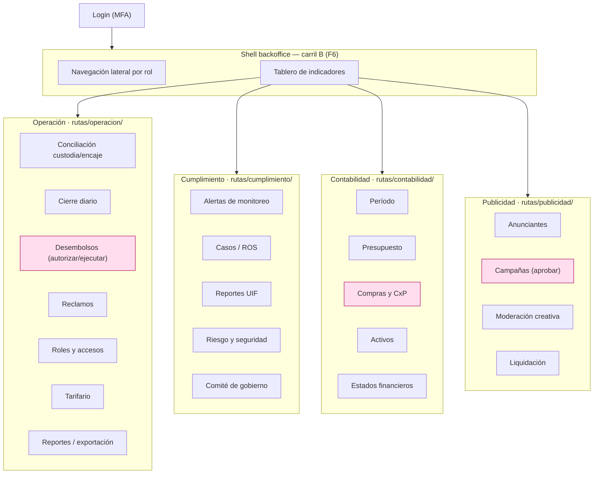

---
tags:
  - producto
  - frontend
  - flujo
  - pantallas
  - backoffice
titulo: "Flujo de pantallas · backoffice administrador"
fecha: 2026-08-19
alcance: apps/backoffice (React + Vite) · el recorrido de [[Flujo funcional · usuario administrador]] pantalla por pantalla
---

# Flujo de pantallas · backoffice administrador

> **Qué es este documento.** El recorrido de [[Flujo funcional · usuario administrador]]
> traducido a **pantallas concretas** de `apps/backoffice` (React 19 + Vite, TanStack Router
> file-based, TanStack Query). Espejo, del lado de operación, de
> [[Flujo de pantallas · app del participante]]. Cada pantalla dice su ruta, qué organismos de
> `packages/ui` compone, sus estados, el **permiso** que la habilita, el AF/CU que sirve, el
> endpoint del gateway y **qué carril** la construye (`planes/16 · Carriles de frontend`).
>
> **Stack.** Front = **monorepo yarn workspaces orquestado con Turborepo**. El backoffice es
> **React + Vite** con **TanStack Router** (una ruta = un archivo, sin router central) y
> **TanStack Query** para el estado de servidor. Va **detrás de login y `noindex`**. Habla con
> los microservicios **Spring Boot** por el gateway, vía el cliente generado
> `clientes/typescript`.

## 0 · Reglas que valen para toda pantalla del backoffice

1. **Pantallas densas, no la app estirada** ([[ADR-004 Frontend]]): escritorio, tablas
   grandes, filtros y exportación. El organismo de trabajo es **`TablaDeDatos`** (toolbar con
   búsqueda y filtros, orden por columna, selección múltiple, paginación y **virtualización**).
2. **Los cuatro estados, siempre**: cargando (esqueleto) · vacío · error (con `sinConexion`) ·
   con datos. Ninguna tabla sin sus cuatro estados.
3. **El permiso manda la ruta.** Cada ruta declara el permiso que exige; sin él, no se monta y
   no aparece en la navegación. El guard de la API **niega por omisión** — la UI solo refleja
   lo que el token ya permite ([[ADR-024 Autenticación y sesión distribuida]]).
4. **Segregación en pantalla.** Cuando una acción exige doble control (autorizar vs ejecutar),
   la pantalla del segundo rol muestra lo que el primero dejó **listo para** su paso, nunca el
   botón del otro lado. Un mismo operador no ve los dos botones.
5. **Todo deja rastro.** Cada acción con efecto pide **motivo** y queda en la bitácora; las
   pantallas de decisión que perjudican a alguien siguen el patrón de **debido proceso**
   (causal → notificación → descargo → decisión motivada → apelación por otro).

## 1 · Mapa de navegación

> Los bloques rosados exigen **doble control**: la pantalla nunca muestra los dos lados al mismo
> operador.

---

## 2 · Shell y tablero · carril **B** (F6) · `apps/backoffice/src/{layout,proveedores}/`

- **`layout/`**: navegación lateral que se arma **según los permisos del token** (un rol de
  cumplimiento no ve el menú de contabilidad). Cabecera con el rol activo y cierre de sesión.
- **`proveedores/ProveedorSesion`**: token en almacenamiento seguro del navegador, bearer en
  cada llamada, `401 → refresh → reintento`, y expone los permisos para el guard de rutas.
- **`organismos/TablaDeDatos`**: lo construye este carril y lo consumen todas las rutas
  (`planes/16 §4`). Es la pieza más reusada del backoffice.
- **Tablero** (AF-02 · [[CU-98 Publicar el tablero de indicadores]]): organismo `PanelKPIs`
  (molécula `TarjetaKPI`) filtrado por la familia de indicadores del rol. `GET /indicadores`.
- **`operacion/estado`** — Estado de la plataforma y sus artefactos (AF-02b): organismo
  `PanelEstadoPlataforma` (tarjetas de salud: servicios arriba/abajo, rezago de outbox y
  réplica, cierres pendientes, verificaciones y reclamos en cola, conciliaciones sin cuadrar,
  reportes por vencer). **Solo lectura**; cada tarjeta enlaza a la pantalla donde se actúa.
  `GET /auditoria/estado`, `GET /indicadores`.

---

## 3 · Operación · carril **B1** (F7) · `apps/backoffice/src/rutas/operacion/`

### 3.1 · `operacion/conciliacion` — Conciliar custodia y encaje (AF-09 · [[CU-50 Conciliar la custodia y verificar el encaje]])
- **Permiso:** TESORERIA. **Compone:** `TablaDeDatos` (movimientos vs extracto) +
  `PanelDescuadre` (un descuadre abre evento de riesgo, no se ajusta). **Estados:** los cuatro.
  **Endpoint:** `GET /conciliacion`, `POST /conciliacion/{id}/excepcion`.

### 3.2 · `operacion/cierre-diario` — Cierre diario (AF-10 · [[CU-51 Ejecutar el cierre diario]])
- **Permiso:** TESORERIA. **Compone:** `ResumenCierre` + `Boton` "Sellar el día" con doble
  confirmación. **Endpoint:** `POST /custodia/cierre-diario`.

### 3.3 · `operacion/desembolsos` — Autorizar / ejecutar (AF-11 · [[CU-28 Emitir la orden de desembolso y ejecutar el intento]] · [[CU-14 Reversar una transacción]])
- **Doble control:** CONTABILIDAD **autoriza** (`PanelAprobacion`), TESORERIA **ejecuta**
  (`PanelEjecucion`); ningún operador ve ambos. **Compone:** `TablaDeDatos` de órdenes +
  el panel de su lado. **Estados:** los cuatro. **Endpoint:** `POST /desembolsos/{id}/autorizar`,
  `POST /desembolsos/{id}/ejecutar`.

### 3.4 · `operacion/reclamos` — Reclamos y denuncias (AF-08 · [[CU-52 Atender un reclamo en plazo]] · [[CU-53 Elevar un reclamo a segunda instancia]])
- **Permiso:** SOPORTE / PUNTO_RECLAMO. **Origen:** el caso lo abre el **usuario final** desde
  la app (reclamo o denuncia a otro usuario, [[Flujo de pantallas · app del participante]] §6b);
  entra **catalogado** por categoría.
- **Compone:** `TablaDeDatos` (bandeja **filtrable por categoría** —`COMISION`,
  `DATOS_PERSONALES`, `GRUPO`, `OPERACION_NO_RECONOCIDA`, `SALDO`, `SERVICIO`, denuncia— con
  **plazo guardado** y semáforo de vencimiento) + `FichaReclamo` con `LineaDeTiempo` de debido
  proceso + `PanelResolucion`.
- **La cola solo tiene lo que la política no cerró.** Un `ChipEstado` marca cada caso:
  **auto-resuelto por política** (aparece resuelto, con la política que lo fundó, solo para
  auditoría) o **pendiente de persona** (llegó acá porque ninguna política aplicaba o la
  política lo marcó sensible). El operador decide **solo** estos últimos.
- **La decisión se registra** siempre (motivo, quién, cuándo, o qué política); la segunda
  instancia la resuelve **otro** rol. **Estados:** los cuatro. **Endpoint:** `GET /reclamos`,
  `POST /reclamos/{id}/resolucion`.

### 3.4b · `operacion/politicas-resolucion` — Catálogo de políticas de resolución (AF-08)
- **Permiso:** ADMIN_PLATAFORMA / OFICIAL. **Compone:** `TablaDeDatos` de políticas +
  `EditorDePolitica` (condición, categoría, acción del **catálogo cerrado**, tope leído del
  catálogo) + **`SimuladorDeReglas`** (obligatorio antes de activar: contra casos históricos).
  Es lo que hace que el reclamo se **auto-resuelva** cuando una política aplica y escale a
  persona cuando no (patrón `motor-de-reglas`). **Endpoint:** `POST /reclamos/politicas`,
  `POST /reclamos/politicas/{id}/simulacion`.

### 3.5 · `operacion/roles` — Roles y accesos (AF-17 · [[CU-08 Asignar y revocar roles de operador]])
- **Permiso:** ADMIN_PLATAFORMA. **Compone:** `TablaDeDatos` de operadores +
  `EditorDeRoles` que **rechaza en la UI** (y la base) un par incompatible de segregación.
  **Endpoint:** `GET /roles`, `POST /usuarios/{id}/roles`.

### 3.6 · `operacion/tarifario` — Publicar tarifario (AF-18 · [[CU-34 Publicar un tarifario nuevo con preaviso]])
- **Permiso:** ADMIN_PLATAFORMA/gobierno, con doble control. **Compone:** `FormularioTarifario`
  + `PanelPreaviso`; escribe en `catalogo` ([[ADR-029 Catálogo legible por todos los servicios]]).
  **Endpoint:** `POST /tarifas/tarifarios`.

### 3.7 · `operacion/reportes` — Definir, programar y exportar (AF-19 · [[CU-58 Definir, programar y exportar un reporte]])
- **Compone:** `ConstructorDeReporte` (parámetros validados) + `TablaDeDatos` de ejecuciones +
  `Boton` "Exportar" (cifrado y con vencimiento; hash del resultado). **Endpoint:**
  `POST /reportes/definiciones`, `POST /reportes/{id}/ejecutar`.

### 3.8 · `operacion/fondeo` — QR y cuenta recaudadora (AF-21 · [[CU-99 Dar de alta un proveedor de pago y enrutar el cobro]])
- **Permiso:** ADMIN_PLATAFORMA / TESORERIA, **doble control**. **Qué hace:** modifica el **QR y
  la cuenta** donde entra el **dinero real** que se convierte en saldo, y enruta el cobro al
  proveedor vigente.
- **Compone:** `FormularioInstrumentoFondeo` (cuenta/QR, proveedor, vigencia) + `VistaPreviaQR` +
  `PanelSaludProveedor` (ventana móvil, conmutación no silenciosa) + `HistorialFondeo` (el QR
  anterior nunca se borra) + `PanelAprobacion`/`PanelEjecucion` (segregación). **Preaviso** antes
  de publicar. **Estados:** los cuatro. **Endpoint:** `POST /billetera/instrumentos-fondeo`,
  `POST /qr/enrutamiento`.

### 3.9 · `operacion/mensajeria` — Motor de mensajería (AF-22 · [[CU-83 Enrutar el envío por proveedor de mensajería]] · [[CU-80 Despachar una notificación]])
- **Permiso:** ADMIN_PLATAFORMA. **Qué hace:** administra plantillas, canales y enrutamiento de
  los avisos por **intra-app** (bandeja/push) y **externos** (SMS, WhatsApp, correo).
- **Compone:** `EditorDePlantilla` (versionada; `ChipEstado` de versión activa) +
  `MatrizDeCanales` (evento × canal, con consentimiento y tope) + `PanelRuteoProveedor`
  (`PanelSaludProveedor`) + `TablaDeDatos` de la cola de envío y la cola muerta. **Estados:**
  los cuatro. **Endpoint:** `GET /notificaciones/plantillas`, `POST /notificaciones/plantillas`,
  `POST /notificaciones/enrutamiento`.

---

## 4 · Cumplimiento · carril **B2** (F8) · `apps/backoffice/src/rutas/cumplimiento/`

### 4.0 · `cumplimiento/verificaciones` — Revisar y aceptar/rechazar (AF-02c · [[CU-01 Registro y apertura de billetera]] · [[CU-02 Elevar nivel de debida diligencia]])
- **Permiso:** ANALISTA/OFICIAL_CUMPLIMIENTO. **Compone:** `TablaDeDatos` (cola de casos
  pendientes, básica y profunda) + `RevisorDeIdentidad` (visor de documento/selfie/PEP con
  `Boton` "Aceptar" y "Rechazar"). **Rechazar exige causal** y notifica al titular con su
  derecho a subsanar (debido proceso). **La decisión se registra** en el expediente.
  **Estados:** los cuatro (vacío = "sin verificaciones pendientes"). **Endpoint:**
  `GET /cumplimiento/verificaciones`, `POST /usuarios/{id}/verificacion/decision`.

### 4.1 · `cumplimiento/alertas` — Triar alertas (AF-03 · [[CU-44 De alerta de monitoreo a reporte de operación sospechosa]])
- **Permiso:** CUMPLIMIENTO_ALERTAS. **Compone:** `TablaDeDatos` de alertas (prioridad, edad) +
  `PanelTriaje` (descartar con motivo / escalar a caso). **Estados:** los cuatro (vacío = "sin
  alertas abiertas"). **Endpoint:** `GET /cumplimiento/alertas`.

### 4.2 · `cumplimiento/casos` — Caso y ROS (AF-03 · [[CU-41 Detectar umbral y registrar formulario PCC-01]] · [[CU-42 Detectar umbral y registrar ROG]])
- **Compone:** `FichaCaso` (evidencia que ya existe en el sistema) + `PanelROS` — el envío del
  **ROS lo confirma otra identidad** (segregación en pantalla). **Endpoint:**
  `POST /cumplimiento/casos`, `POST /cumplimiento/casos/{id}/ros`.

### 4.3 · `cumplimiento/uif` — Reportes y requerimientos (AF-04 · [[CU-43 Remitir los reportes mensuales a la UIF]] · [[CU-45 Atender un requerimiento de autoridad]])
- **Compone:** `TablaDeDatos` (calendario de remisión con vencimientos y acuse) +
  `FormularioRequerimiento`. **Endpoint:** `GET /uif/reportes`, `POST /uif/reportes/{id}/remision`.

### 4.4 · `cumplimiento/riesgo` — Riesgo y seguridad (AF-06/07 · [[CU-54 Registrar un evento de riesgo operativo]] · [[CU-55 Gestionar un incidente de seguridad]] · [[CU-56 Ejecutar una prueba de continuidad]])
- **Permiso:** RESPONSABLE_RIESGOS / RESPONSABLE_SEGURIDAD. **Compone:** `TablaDeDatos` de
  eventos/incidentes + `FichaIncidente`. **Endpoint:** `GET /auditoria/eventos-riesgo`,
  `POST /auditoria/incidentes`.

### 4.5 · `cumplimiento/gobierno` — Comité (AF-20 · [[CU-94 Elevar una decisión al comité de gobierno]])
- **Compone:** `TablaDeDatos` de decisiones + `ActaComite` (voto nominal, quórum, abstención
  registrada). El efecto se aplica en la **misma transacción** que cierra el acta.
  **Endpoint:** `POST /cumplimiento/comite/actas`.

---

## 5 · Contabilidad y ERP · carril **B3** (F13) · `apps/backoffice/src/rutas/contabilidad/`

| Ruta | AF · CU | Organismos | Endpoint |
| --- | --- | --- | --- |
| `contabilidad/periodo` | AF-12 · [[CU-100 Abrir y cerrar el período contable]] | `PanelPeriodo` (abrir/cerrar con confirmación) | `POST /erp/periodos/{id}/cierre` |
| `contabilidad/presupuesto` | AF-13 · [[CU-101 Presupuestar por centro de costo]] | `TablaDeDatos` + `EditorPresupuesto` | `POST /erp/presupuestos` |
| `contabilidad/compras` | AF-13 · [[CU-102 Dar de alta un tercero comercial y su orden de compra]] · [[CU-103 Registrar y pagar una factura de proveedor]] | `TablaDeDatos` + `FichaFactura` (**registra ≠ paga**) | `POST /erp/ordenes-compra`, `POST /erp/facturas` |
| `contabilidad/cobros` | AF-13 · [[CU-104 Cobrar una cuenta por cobrar]] | `TablaDeDatos` de CxC | `POST /erp/cuentas-por-cobrar/{id}/cobro` |
| `contabilidad/activos` | AF-14 · [[CU-105 Depreciar un activo fijo]] | `TablaDeDatos` + `PanelDepreciacion` | `POST /erp/activos/{id}/depreciacion` |
| `contabilidad/estados` | AF-14 · [[CU-106 Generar el estado financiero del período]] | `VisorEstadoFinanciero` | `POST /erp/estados-financieros` |

Todas con los cuatro estados; el permiso es `CONTABILIDAD_ERP_*` según la acción, y el pago de
una factura lo ejecuta **Tesorería**, no quien la registró.

---

## 6 · Publicidad · carril **B4** (F14) · `apps/backoffice/src/rutas/publicidad/`

| Ruta | AF · CU | Organismos | Endpoint |
| --- | --- | --- | --- |
| `publicidad/partners` | AF-15a · socios comerciales | `TablaDeDatos` + `FormularioPartner` | `POST /publicidad/socios` |
| `publicidad/anunciantes` | AF-15b · [[CU-110 Dar de alta un anunciante y su cuenta publicitaria]] | `TablaDeDatos` + `FormularioAnunciante` | `POST /anunciantes` |
| `publicidad/campanas` | AF-15 · [[CU-111 Crear y aprobar una campaña publicitaria]] | `TablaDeDatos` + `PanelAprobacionCampana` (**gestionar ≠ aprobar**) | `POST /campanas`, `POST /campanas/{id}/aprobacion` |
| `publicidad/moderacion` | AF-16 · [[CU-112 Moderar una pieza creativa]] | `ColaModeracion` (MODERADOR_CONTENIDO) | `POST /publicidad/piezas/{id}/moderacion` |
| `publicidad/liquidacion` | AF-16 · [[CU-114 Liquidar y facturar el gasto publicitario]] | `TablaDeDatos` de liquidaciones | `POST /publicidad/liquidaciones` |

---

## 7 · Organismos que el backoffice suma al sistema de diseño

Los construye **F1** (`packages/ui`) o el shell **B** (F6, `TablaDeDatos`), y los carriles
B1–B4 solo los componen. Entra al alcance de `planes/11 · Fases F0 y F1`:

| Organismo | Área | Carril |
| --- | --- | --- |
| `TablaDeDatos` (toolbar, filtros, orden, selección, virtualización), `PanelKPIs` (`TarjetaKPI`), `PanelEstadoPlataforma` | shell/tablero | B (F6) |
| `PanelDescuadre`, `ResumenCierre`, `PanelAprobacion`/`PanelEjecucion`, `FichaReclamo` (`LineaDeTiempo`), `PanelResolucion`, `EditorDePolitica`/`SimuladorDeReglas`, `EditorDeRoles`, `FormularioTarifario`/`PanelPreaviso`, `ConstructorDeReporte`, `FormularioInstrumentoFondeo`/`VistaPreviaQR`/`HistorialFondeo`, `EditorDePlantilla`/`MatrizDeCanales`/`PanelRuteoProveedor` | operación | B1 (F7) |
| `RevisorDeIdentidad`, `PanelTriaje`, `FichaCaso`, `PanelROS`, `FormularioRequerimiento`, `FichaIncidente`, `ActaComite` | cumplimiento | B2 (F8) |
| `PanelPeriodo`, `EditorPresupuesto`, `FichaFactura`, `PanelDepreciacion`, `VisorEstadoFinanciero` | contabilidad | B3 (F13) |
| `FormularioPartner`, `FormularioAnunciante`, `PanelAprobacionCampana`, `ColaModeracion` | publicidad | B4 (F14) |
| `PanelSaludProveedor` (compartido por fondeo y mensajería) | transversal | sube a `packages/ui` |

**Regla de subida:** `TablaDeDatos`, `PanelAprobacion`/`PanelEjecucion` y `LineaDeTiempo` son
transversales a operación/cumplimiento/contabilidad → suben a `packages/ui`; las fichas y
paneles específicos de un dominio viven en su ruta. Los **mismos tokens y átomos** que la app
móvil ([[Flujo de pantallas · app del participante]] §7): el backoffice no es un segundo
sistema de diseño, es el mismo portado a densidad de escritorio.

## Ver también

[[Flujo funcional · usuario administrador]] · `planes/16 · Carriles de frontend` ·
`planes/11 · Fases F0 y F1` · [[Flujo de pantallas · app del participante]] ·
[[ADR-004 Frontend]] · [[ADR-031 Lecturas, réplica y rol auditor]] · `disenar-frontend` ·
`web-backoffice` · `roles-y-accesos`
