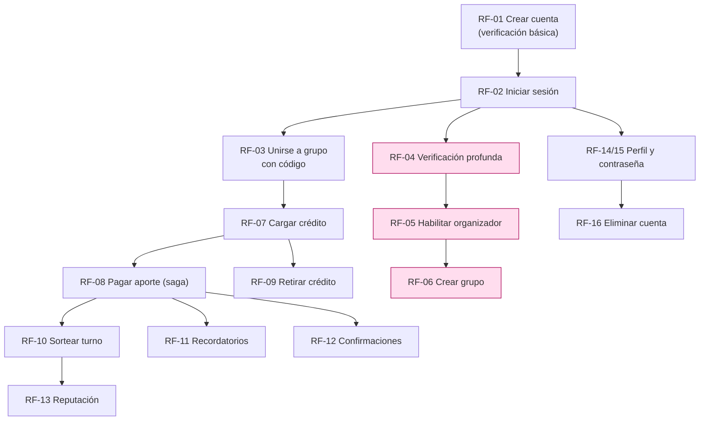

---
tags:
  - producto
  - requisitos
  - flujo
titulo: "Flujo funcional · recorrido del usuario"
fecha: 2026-08-18
alcance: los requisitos funcionales del recorrido de un participante, anclados a los casos de uso de docs/CasosDeUso/
---

# Flujo funcional · recorrido del usuario

> **Qué es este documento.** El recorrido de punta a punta de una persona en AportaYa,
> descrito como requisitos funcionales (RF) y **anclado a los casos de uso que ya existen**
> en [[_CasosDeUso]]. No inventa comportamiento: cada RF apunta al CU que lo implementa,
> con su precondición, su disparador y el estado que deja. Donde el detalle fino viva en el
> CU, manda el CU.
>
> **La regla que ordena todo el recorrido:** el nivel de verificación de la identidad decide
> qué puede hacer cada quien. Ver §0.

## 0 · La regla de acceso: verificación básica vs. profunda

AportaYa custodia dinero ajeno, así que **cuánto conocés a la persona decide qué la dejás
hacer**. Hay dos niveles de conocimiento del cliente (debida diligencia), y cada capacidad
cuelga de uno:

| Nivel | Cómo se alcanza | Qué habilita |
| --- | --- | --- |
| **Básica** | Registro con documento y datos mínimos ([[CU-01 Registro y apertura de billetera]]) | Loguearse, unirse a un grupo por invitación, aportar, cargar y retirar crédito dentro de límites bajos, recibir turnos y notificaciones |
| **Profunda** (reforzada) | Elevar el nivel: verificación documental reforzada, declaración PEP y beneficiario final ([[CU-02 Elevar nivel de debida diligencia]] · [[CU-03 Declaración PEP y beneficiario final]]) | Todo lo anterior **más límites altos** y, sobre todo, **poder crear y organizar grupos** ([[CU-90 Postular a organizador y habilitarse]] → [[CU-20 Crear grupo y congelar tarifario]]) |

> [!important] El gate central
> **Unirse** a un grupo requiere verificación **básica**. **Crear** un grupo requiere
> verificación **profunda** y habilitación de organizador. Un usuario con nivel básico que
> intente crear un grupo se rechaza con el código de error del CU correspondiente, no con un
> mensaje genérico.

Los límites por nivel no están cableados: viven en el catálogo (`limite_operativo_billetera`,
[[ADR-029 Catálogo legible por todos los servicios]]) y se leen antes de cada operación de
dinero. Sin límite vigente a la fecha, la operación se **rechaza**.

---

## 1 · Registro y acceso

### RF-01 · Crear cuenta con verificación básica
- **Actor:** persona nueva. **Disparador:** completa el registro en la app.
- **Precondición:** ninguna (es la puerta de entrada).
- **Implementa:** [[CU-01 Registro y apertura de billetera]] — crea la identidad, corre la
  verificación documental básica y abre la billetera en el mismo acto (la cuenta de billetera
  la abre `nucleo-financiero` al consumir el evento `identidad.usuario_creado`, patrón evento
  S4 de [[ADR-028 Mecánica de saga]]).
- **Encadena:** [[CU-05 Aceptar contrato de adhesión y tarifario]] — el alta no queda firme
  hasta aceptar el contrato de adhesión y el tarifario vigente, con su hash guardado.
- **Estado que deja:** usuario con nivel **básico**, billetera abierta en saldo cero.

### RF-02 · Iniciar sesión
- **Actor:** usuario registrado. **Disparador:** login.
- **Implementa:** [[CU-04 Autenticar con MFA y registrar dispositivo]] — credencial + segundo
  factor; el dispositivo se registra como de confianza y la sesión emite el token que después
  se convierte en contexto de RLS ([[ADR-024 Autenticación y sesión distribuida]]).
- **Estado que deja:** sesión activa; token con `jti` revocable.

---

## 2 · Unirse a un grupo

### RF-03 · Unirse a un grupo con código dado
- **Actor:** usuario con verificación **básica**. **Disparador:** recibe un código/enlace de
  invitación y lo canjea.
- **Precondición:** verificación básica vigente; contrato de adhesión aceptado (RF-01).
- **Implementa:** [[CU-69 Invitar a un contacto y registrar sus referencias]] — la invitación
  es un **token de un solo uso**; canjearlo vincula a la persona al grupo y registra sus
  referencias personales.
- **Alternativa sin código:** [[CU-68 Postular a un grupo y ser emparejado]] — postulación con
  puntaje explicable y emparejamiento por criterio versionado.
- **Encadena:** aceptación del reglamento del grupo antes de ocupar un cupo.
- **Estado que deja:** participante con un cupo asignado en el grupo.

---

## 3 · Verificación profunda y creación de grupos

### RF-04 · Elevar a verificación profunda
- **Actor:** usuario con nivel básico que quiere organizar. **Disparador:** solicita elevar el
  nivel.
- **Implementa:** [[CU-02 Elevar nivel de debida diligencia]] + [[CU-03 Declaración PEP y beneficiario final]]
  — verificación documental reforzada y declaración de persona expuesta y beneficiario final.
- **Estado que deja:** usuario con nivel **profundo**; límites altos habilitados.

### RF-05 · Habilitarse como organizador
- **Precondición:** RF-04 (nivel profundo).
- **Implementa:** [[CU-90 Postular a organizador y habilitarse]] — requisitos medibles,
  capacitación con vigencia y contrato de organizador firmado con hash.
- **Estado que deja:** organizador habilitado.

### RF-06 · Crear un grupo
- **Precondición:** RF-05 (organizador habilitado).
- **Implementa:** [[CU-20 Crear grupo y congelar tarifario]] — crea el grupo, fija cupos y
  turnos y **congela el tarifario** vigente para todo el ciclo del grupo.
- **Estado que deja:** grupo activo con su reglamento y tarifario congelado; `nucleo-financiero`
  abre la cuenta del grupo al consumir `grupos.grupo_activado` (evento S5).

---

## 4 · Operar dinero

### RF-07 · Cargar crédito (recargar saldo)
- **Actor:** participante (nivel básico basta). **Disparador:** recarga por QR/pasarela o
  efectivo en punto de atención.
- **Implementa:** [[CU-10 Recargar saldo]] — acredita a la billetera solo cuando el proveedor
  confirma; el saldo no se escribe, se deriva del libro (partida doble).
- **Estado que deja:** saldo disponible mayor.

### RF-08 · Realizar el pago del aporte
- **Actor:** participante. **Disparador:** vence el aporte del período.
- **Precondición:** grupo activo; obligación de aporte generada.
- **Implementa:** [[CU-21 Cobrar el aporte del período]] — **saga orquestada S1**
  (`aportes` → `nucleo-financiero` para el débito + asiento → `tarifas` para el devengo);
  si un paso falla, se compensa con el reverso y la obligación vuelve a `PENDIENTE`
  ([[ADR-028 Mecánica de saga]]).
- **Estado que deja:** aporte del período pagado; asiento contable cuadrado.

### RF-09 · Retirar crédito
- **Actor:** participante o beneficiario. **Disparador:** solicita retiro.
- **Precondición:** cuenta bancaria de destino verificada ([[CU-18 Registrar y verificar una cuenta bancaria de destino]]);
  límite de retiro vigente.
- **Implementa:** [[CU-11 Retirar saldo]] — orden de retiro idempotente hacia la cuenta
  verificada; el intento se clasifica y reintenta según error.
- **Estado que deja:** saldo debitado y desembolso en curso hacia el banco.

---

## 5 · Turno y transparencia

### RF-10 · Sortear el turno
- **Actor:** organizador / sistema. **Disparador:** el grupo llega al momento del sorteo.
- **Implementa:** [[CU-60 Sortear los turnos]] — sorteo determinista y **verificable**: el
  orden de cobro queda sellado y cualquiera puede reproducir el resultado
  ([[CU-61 Verificar públicamente el sorteo]]).
- **Estado que deja:** orden de turnos fijado y publicado, sin que nadie tenga que “creerle”
  al organizador.

---

## 6 · Notificaciones

### RF-11 · Recibir recordatorios de aporte
- **Disparador:** se acerca el vencimiento del aporte.
- **Implementa:** [[CU-81 Programar recordatorios de aporte]] → [[CU-80 Despachar una notificación]]
  — la programación la dispara el propio servicio (ShedLock); `notificaciones` solo renderiza y
  envía, con plantilla versionada y respeto del consentimiento y el tope de mensajes.

### RF-12 · Recibir confirmaciones
- **Disparador:** un hecho relevante confirmado (pago acreditado, entrega realizada, retiro
  ejecutado).
- **Implementa:** [[CU-80 Despachar una notificación]] a partir del evento de dominio del
  hecho — el aviso sale **después** de que el hecho quedó firme, nunca sobre una probabilidad.

---

## 7 · Reputación

### RF-13 · Recibir la calificación de otro usuario
- **Disparador:** un participante con convivencia comprobada reseña a otro, o el sistema
  registra un hecho de comportamiento (pagó a tiempo, incumplió).
- **Implementa:** [[CU-76 Reseñar a un participante y moderar la reseña]] y
  [[CU-70 Registrar un evento de reputación]] → [[CU-71 Recalcular el puntaje de reputación]]
  — la reseña se modera; el puntaje se recalcula con factores guardados y explicables.
- **Estado que deja:** puntaje de reputación actualizado, con su rastro auditable.

---

## 8 · Cuenta: perfil, credenciales y baja

### RF-14 · Modificar la contraseña
- **Actor:** usuario autenticado. **Implementa:** [[CU-09 Cambiar credenciales y solicitar la baja]]
  — cambio de credencial con Argon2id, rotación e invalidación de sesiones si corresponde.

### RF-15 · Modificar el perfil
- **Actor:** usuario autenticado. **Implementa:** [[CU-07 Ejercer derechos sobre datos personales]]
  — rectificación de datos personales con registro de acceso y cambio.

### RF-16 · Eliminar la cuenta
- **Actor:** usuario autenticado. **Disparador:** solicita la baja.
- **Precondición:** sin saldo pendiente ni obligaciones abiertas; si hay saldo, se devuelve
  primero.
- **Implementa:** [[CU-09 Cambiar credenciales y solicitar la baja]] (solicitud de baja) +
  [[CU-16 Cerrar billetera y devolver saldo]] — la billetera se cierra devolviendo el saldo, y
  la baja respeta la retención legal de los datos que la norma obliga a conservar.
- **Estado que deja:** cuenta dada de baja; datos conservados solo lo que exige la ley.

---

## 9 · El recorrido de un vistazo

> El camino rosado (RF-04 → RF-06) es el que exige **verificación profunda**. Todo lo demás
> corre con verificación básica.

> **El detalle de pantallas.** Cada RF de este recorrido se traduce a pantallas concretas de
> la app móvil en [[Flujo de pantallas · app del participante]] — ruta de Expo Router,
> organismos de `packages/ui`, los cuatro estados, navegación y el carril que la construye.

## Ver también

[[_CasosDeUso]] · [[Flujo de pantallas · app del participante]] · [[ADR-028 Mecánica de saga]] ·
[[ADR-029 Catálogo legible por todos los servicios]] ·
[[ADR-024 Autenticación y sesión distribuida]] · `kyc-onboarding` · `gobernanza-grupo` ·
`contabilidad-partida-doble`
