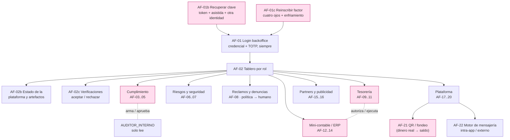

---
tags:
  - producto
  - requisitos
  - flujo
  - backoffice
titulo: "Flujo funcional · usuario administrador"
fecha: 2026-08-19
alcance: el recorrido del operador del backoffice (apps/backoffice), por rol, anclado a los casos de uso de docs/CasosDeUso/
---

# Flujo funcional · usuario administrador

> ⛔ **Antes de implementar algo de este documento, leé y obedecé
> [[Contrato de implementación para IA]].** No inventes tablas, columnas, endpoints, roles,
> permisos ni CU: si no está pineado acá o en una fuente de verdad, es un **hueco**, no algo
> que completás. La segregación de funciones y el default-deny los fija el backend, no la UI.

> **Qué es este documento.** El recorrido del **operador del backoffice** de AportaYa —el
> "usuario administrador"— descrito como acciones funcionales (AF) y **anclado a los casos de
> uso que ya existen** en [[_CasosDeUso]]. Es el espejo, del lado de operación y cumplimiento,
> de [[Flujo funcional · recorrido del usuario]] (el participante). Su detalle de pantallas
> vive en [[Flujo de pantallas · backoffice administrador]].
>
> **No es un solo usuario: es una familia de roles.** "Administrador" no es una persona con
> todos los poderes; es **el permiso que su rol le otorga**, y el diseño impide a propósito que
> un rol acumule poderes que deben estar separados (§0).

## 0 · La regla de acceso: default-deny, roles y segregación de funciones

El backoffice (`apps/backoffice`, React + Vite, detrás de login, `noindex`) no tiene un
"modo admin". Cada acción exige un **permiso**, cada permiso cuelga de un **rol**, y el guard
de la API **niega por omisión** ([[ADR-024 Autenticación y sesión distribuida]], skill
`roles-y-accesos`). Los roles operativos son:

| Rol | Para qué entra | Permisos núcleo |
| --- | --- | --- |
| **ADMIN_PLATAFORMA** | Configurar la plataforma, roles, catálogos, tarifario | `CATALOGO_EDITAR`, `TARIFARIO_PUBLICAR`, `ACCESOS_ADMINISTRAR`, `SEGURIDAD_ACCESO_RESTABLECER`, `SEGURIDAD_FACTOR_REINSCRIBIR` |
| **OFICIAL_CUMPLIMIENTO** · **ANALISTA_CUMPLIMIENTO** | Triar alertas, armar casos, reportar a la UIF | `CUMPLIMIENTO_ALERTAS`, `_CASOS`, `_REPORTAR` |
| **AUDITOR_INTERNO** | Leer todo el rastro sin escribir nada | `AUDITORIA_LEER` |
| **RESPONSABLE_RIESGOS** | Eventos de riesgo, alertas tempranas, indicadores | riesgo operativo, KPIs |
| **RESPONSABLE_SEGURIDAD** | Incidentes de seguridad, continuidad y el acceso de los demás operadores | incidentes, pruebas de continuidad, `SEGURIDAD_ACCESO_RESTABLECER`, `SEGURIDAD_FACTOR_REINSCRIBIR` |
| **SOPORTE** · **PUNTO_RECLAMO** | Atender reclamos y su segunda instancia | `RECLAMO_ATENDER` |
| **TESORERIA** | Conciliar custodia/encaje, ejecutar desembolsos | `ENTREGA_EJECUTAR`, conciliación |
| **CONTABILIDAD** | Libro, período, ERP, autorizar pagos | `CONTABILIDAD_ERP_*` |
| **OPERADOR_PUBLICIDAD** · **MODERADOR_CONTENIDO** | Campañas, aprobación y moderación | `PUBLICIDAD_*` |

> [!important] Segregación de funciones — el gate central del backoffice
> Ningún rol reúne los dos lados de una decisión de dinero o de castigo. Los pares
> **incompatibles** (skill `roles-y-accesos`) los hace cumplir la base, no la UI:
> - **CONTABILIDAD autoriza el pago · TESORERIA lo ejecuta** — nadie acumula ambos.
> - **Quien arma un caso de cumplimiento no se auto-aprueba**: el reporte a la UIF exige otra identidad.
> - **Quien opera una campaña no la aprueba ni la modera** (`PUBLICIDAD_CAMPANA_GESTIONAR` ≠ `_APROBAR` ≠ `_MODERAR`).
> - **AUDITOR_INTERNO solo lee** (`rol_auditor`, `BYPASSRLS`, contra la réplica, [[ADR-031 Lecturas, réplica y rol auditor]]): jamás escribe.
> Toda acción del backoffice queda en la **bitácora** con actor, rol y motivo — el debido
> proceso (`debido-proceso`) y la auditoría se sostienen en ese rastro.

**Toda decisión que perjudica a alguien pasa por debido proceso**: causal escrita,
notificación probada, plazo guardado, descargo, decisión motivada y apelación resuelta por
**otra** persona (skill `debido-proceso`). El backoffice es donde esas decisiones se toman.

---

## 1 · Acceso y tablero

### AF-01 · Iniciar sesión en el backoffice
- **Actor:** cualquier operador. **Implementa:**
  [[CU-04 Autenticar con MFA y registrar dispositivo]].
- **Dos factores en todo acceso, sin excepción.** Credencial + **TOTP** de aplicación
  autenticadora. No hay atajo biométrico, no hay «recordar este equipo» y el dispositivo
  marcado confiable **no exime**: lo que para el participante es comodidad, para el
  operador convierte el robo del equipo en el robo del rol
  ([[ADR-038 Acceso administrativo · segundo factor y recuperación asistida]]).
- **No lo hace la pantalla: lo hace la base.** `R-SEG-10` impide insertar una [[sesion]]
  de un usuario con rol de ámbito `GLOBAL` que no tenga [[factor_mfa]] `TOTP` confirmado,
  y rechaza que su factor sea `SMS` o `WHATSAPP` —canales apagados
  ([[ADR-035 Canales por defecto]]) y expuestos al intercambio de SIM—.
- **La sesión emite un token cuyo rol se convierte en contexto de RLS**
  ([[ADR-021 Sesión, RLS y pooling]]), caduca por **inactividad** además de por
  vencimiento, y se cierra del lado del servidor: borrar el token del navegador no
  revoca nada.
- **Reautenticación por paso.** Entrar no autoriza para siempre: toda acción cuyo
  [[permiso]] tenga `requiere_mfa` pide un desafío nuevo, corto y atado a esa operación.
  `R-SEG-12` garantiza que la marca esté puesta donde corresponde —`AUTORIZAR`,
  `APROBAR`, `EJECUTAR`, `REVERSAR`, `PUBLICAR`, `ENVIAR`, `CERRAR` y `LEER_TERCEROS`—,
  para que «sensible» no sea criterio de quien programa.
- **Sin factor no hay operador.** Una [[asignacion_rol]] recién otorgada
  ([[CU-08 Asignar y revocar roles de operador]]) deja a la persona sin poder entrar
  hasta que enrola su TOTP y guarda sus códigos de respaldo. Eso es lo correcto, no un
  defecto: el alta termina en el enrolamiento, no en la asignación.

### AF-01b · Recuperar la contraseña de un operador
- **Actores:** el operador que la perdió · **otra identidad** con
  `SEGURIDAD_ACCESO_RESTABLECER` (RESPONSABLE_SEGURIDAD o ADMIN_PLATAFORMA).
  **Implementa:** [[CU-09 Cambiar credenciales y solicitar la baja]] §8.
- **Nunca por autoservicio.** El motivo cabe en una línea: quien tomó el canal de
  recuperación es exactamente quien lo va a usar. Hacen falta **tres cosas**, y las tres
  quedan escritas: token de un solo uso al canal verificado, **verificación asistida**
  con prueba de vida y documento, y **aprobación de otra persona** —jamás el titular—.
- **El corte es total.** En la misma transacción del hash nuevo, `R-SEG-11` revoca
  **todas** las [[sesion]] (sin la excepción «salvo la que hizo el cambio» que sí tiene
  el participante, porque acá el que la hizo puede ser el atacante), quita `es_confiable`
  a todos sus [[dispositivo]] e invalida los refrescos emitidos.
- **Recuperar la clave no devuelve el segundo factor.** Son dos secretos y dos caminos:
  quien obtuvo la contraseña sigue sin el TOTP, y `R-SEG-10` le cierra la sesión antes de
  abrirla.

### AF-01c · Reinscribir el segundo factor de un operador
- **Actores:** el operador que perdió el teléfono · **otra identidad** con
  `SEGURIDAD_FACTOR_REINSCRIBIR`. **Implementa:**
  [[CU-09 Cambiar credenciales y solicitar la baja]] §9.
- **A cuatro ojos, con causal escrita y verificación asistida.** Nadie se reinscribe a sí
  mismo: el factor es justamente lo que queda en pie cuando la contraseña cae.
- **Con enfriamiento.** Durante el plazo que fija la política —**guardado al inicio**, no
  recalculado al consultar (`plazos-habiles`)— el operador entra y trabaja, pero **no
  ejecuta** ninguna acción con `requiere_mfa`. Es la ventana de enfriamiento del
  participante, aplicada del lado que puede mover plata ajena.
- **Los códigos de respaldo son la salida ordinaria**, no el trámite: se entregan al
  enrolar y existen para que perder el teléfono no active este procedimiento cada vez.

### AF-02 · Ver el tablero de indicadores
- **Actor:** según rol (cada uno ve su familia de KPIs). **Implementa:**
  [[CU-98 Publicar el tablero de indicadores]] — cifras reproducibles sobre la réplica de
  lectura, con metas fijadas antes del período y provisorios marcados como tales.

### AF-02b · Revisar el estado de la plataforma y sus artefactos
- **Actor:** ADMIN_PLATAFORMA (y, en su recorte, cada responsable). **Disparador:** entra a
  ver "cómo está todo".
- **Qué muestra:** el estado operativo de los **elementos principales del proyecto** y sus
  **artefactos** — servicios arriba/abajo, rezago del outbox y de la réplica, cierres diarios
  pendientes, verificaciones y reclamos en cola, conciliaciones sin cuadrar, reportes por
  vencer. Es la conciencia de situación, no un KPI de negocio.
- **Se apoya en:** la observabilidad del sistema (`observabilidad`) e
  [[CU-98 Publicar el tablero de indicadores]]; cada tarjeta enlaza a la pantalla donde se
  actúa. **Solo lectura**; no decide nada por sí mismo.

## 1.5 · Verificaciones pendientes

### AF-02c · Revisar casos de verificación y aceptar o rechazar
- **Actor:** ANALISTA_CUMPLIMIENTO / OFICIAL_CUMPLIMIENTO (revisor de identidad).
- **Disparador:** un participante completó su verificación básica ([[CU-01 Registro y apertura de billetera]])
  o pidió elevar a profunda ([[CU-02 Elevar nivel de debida diligencia]]) y el caso quedó
  **pendiente de revisión**.
- **Acción:** revisa la evidencia (documento, selfie, declaración PEP) y **acepta o rechaza**.
  - **Aceptar** otorga el nivel; el participante queda habilitado para lo que ese nivel
    permite ([[Flujo funcional · recorrido del usuario]] §0).
  - **Rechazar** exige **causal escrita** y notifica al titular con su derecho a subsanar
    (debido proceso, `debido-proceso`).
- **Se registra la decisión** (aceptado/rechazado, revisor, motivo, fecha) en el expediente del
  cliente; queda en la bitácora y es auditable.
- **Segregación:** el revisor no es quien cargó los datos, y una segunda revisión (elevación de
  riesgo) puede exigir otra identidad.

---

## 2 · Cumplimiento (OFICIAL / ANALISTA)

### AF-03 · Triar una alerta de monitoreo y elevarla a ROS
- **Implementa:** [[CU-44 De alerta de monitoreo a reporte de operación sospechosa]] — la
  alerta se investiga, se arma el caso y, si corresponde, se eleva a **ROS**; el reporte lo
  confirma **otra identidad** (segregación).
- **Encadena:** umbrales [[CU-41 Detectar umbral y registrar formulario PCC-01]] ·
  [[CU-42 Detectar umbral y registrar ROG]].

### AF-04 · Remitir los reportes a la UIF y atender requerimientos
- **Implementa:** [[CU-43 Remitir los reportes mensuales a la UIF]] con acuse y control de
  vencimientos; [[CU-45 Atender un requerimiento de autoridad]].

### AF-05 · Calibrar reglas, revisar KYC y evaluar productos
- **Implementa:** [[CU-48 Calibrar reglas de cumplimiento y triar sus alertas]] (simulación
  antes de activar) · [[CU-06 Revisión periódica de conocimiento del cliente]] ·
  [[CU-47 Evaluar el riesgo del producto antes de lanzarlo]] ·
  [[CU-49 Designar al oficial de cumplimiento y capacitar]].

---

## 3 · Riesgos y seguridad

### AF-06 · Registrar y seguir un evento de riesgo operativo
- **Actor:** RESPONSABLE_RIESGOS. **Implementa:** [[CU-54 Registrar un evento de riesgo operativo]]
  · [[CU-97 Anticipar el riesgo con alertas tempranas]] (score con factores guardados; la
  alerta dispara acompañamiento, no castigo por pronóstico).

### AF-07 · Gestionar un incidente de seguridad y probar continuidad
- **Actor:** RESPONSABLE_SEGURIDAD. **Implementa:** [[CU-55 Gestionar un incidente de seguridad]]
  · [[CU-56 Ejecutar una prueba de continuidad]].

---

## 4 · Gestión de reclamos y denuncias (SOPORTE / PUNTO_RECLAMO)

Un reclamo puede resolverse **solo** si una política lo cubre; si ninguna política aplica,
**recién ahí** interviene una persona. El operador del backoffice atiende exactamente lo que la
máquina no pudo cerrar.

### El origen: el usuario final abre el caso
El caso **no nace en el backoffice**. El participante lo abre desde la app
([[Flujo funcional · recorrido del usuario]] RF-17 y RF-18):
- **Reclamo** — sobre el servicio, un cobro, el saldo, un grupo, sus datos. Entra **catalogado**
  por `categoria` (`COMISION`, `DATOS_PERSONALES`, `GRUPO`, `OPERACION_NO_RECONOCIDA`, `SALDO`,
  `SERVICIO`) y por `canal_ingreso` — el catálogo ya existe en `reclamo_cliente`.
- **Denuncia a otro usuario** — reporta la mala conducta de otro participante. Comparte el
  circuito de atención, con su propia categoría. *(El modelo tiene el reclamo catalogado y la
  reseña moderada; la **denuncia entre usuarios** como categoría propia es una extensión a
  declarar —tabla/categoría y su enlace al circuito de sanción del módulo 08— antes de
  implementarla.)*

### AF-08 · Resolver por política, o escalar a una persona
- **Paso 1 — el motor de políticas.** Al ingresar, el reclamo se evalúa contra el **catálogo de
  políticas de resolución** (mismo patrón que `motor-de-reglas`: expresión compilada, umbral que
  apunta al catálogo, **catálogo cerrado de acciones**, simulación antes de activar). Si una
  política **cubre el caso**, lo **auto-resuelve** con su acción (reintegro dentro de un tope,
  respuesta estándar, corrección de dato) y **registra la decisión** con la política que la
  fundó.
- **Paso 2 — intervención humana solo si no hay política.** Si **ninguna** política aplica —o la
  política marca el caso como **sensible y exige confirmación humana**—, el reclamo entra a la
  cola del operador. La persona decide con la evidencia que ya existe en el sistema, y **la
  decisión queda registrada en el caso** (motivo, quién, cuándo).
- **En plazo, con debido proceso.** El plazo hábil se **guarda al inicio** y no se recalcula;
  la reparación puede ser obligatoria. **Implementa:** [[CU-52 Atender un reclamo en plazo]].

### AF-08b · Segunda instancia (apelación)
- Si el titular no queda conforme, apela; la **segunda instancia la resuelve otra persona** que
  la primera. **Implementa:** [[CU-53 Elevar un reclamo a segunda instancia]].

> [!note] Por qué la política primero y la persona después
> Auto-resolver por política hace el circuito **rápido y parejo** (dos casos iguales se
> resuelven igual) y deja a las personas solo lo que de verdad necesita criterio. La regla de
> oro de `motor-de-reglas` se respeta: **nada de números cableados** (los topes viven en el
> catálogo), **simulación antes de activar** una política nueva, y **confirmación humana** para
> lo que la propia política marque como sensible. Cada auto-resolución es tan auditable como una
> decisión humana: se guarda **qué política** la resolvió.

---

## 5 · Tesorería y conciliación

### AF-09 · Conciliar la custodia y verificar el encaje
- **Actor:** TESORERIA. **Implementa:** [[CU-50 Conciliar la custodia y verificar el encaje]] —
  un descuadre abre evento de riesgo, no se "ajusta".

### AF-10 · Ejecutar el cierre diario
- **Implementa:** [[CU-51 Ejecutar el cierre diario]] — sella el día; el saldo diario del libro
  se congela y se cuadra contra el banco.

### AF-11 · Desembolsar: automático por defecto, humano por excepción
- **Actores:** el sistema, para lo rutinario. **CONTABILIDAD** autoriza y **TESORERIA** ejecuta,
  solo para las excepciones. **Implementa:**
  [[CU-28 Emitir la orden de desembolso y ejecutar el intento]] y
  [[CU-14 Reversar una transacción]].
- **La entrega del turno y el retiro chico salen solos** cuando se cumplen las seis condiciones
  de la política ([[Flujo de pantallas · backoffice administrador]] §3.3). Es el caso normal: la
  entrega del pasanaku es un pago **esperado**, a un beneficiario **conocido**, en una fecha que
  el grupo ya sabía, con ocho reglas bloqueantes verificándose antes de liberar el dinero.
- **Al operador le llega lo excepcional**: monto sobre el umbral, primer pago a una cuenta nueva,
  puntaje antifraude alto o alerta abierta, regla bloqueante en rojo, rechazo ambiguo del
  proveedor. Ahí sí, doble control (`R-SEG-04`) y reautenticación por paso (`R-SEG-12`).
- **Un retiro y una entrega no tienen el mismo riesgo** y no comparten umbral: el destino de la
  entrega lo fijó el grupo; el del retiro lo elige la persona y puede ser nuevo. Una sola política
  para los dos sería demasiado floja para uno o demasiado dura para el otro.
- **Lo que nunca sale solo:** ROS, declaración de incumplimiento, sanción, levantamiento de un
  bloqueo de autoridad y cualquier omisión de regla bloqueante.
- **Pendiente antes de dinero real:** no objeción del comité vía
  [[CU-47 Evaluar el riesgo del producto antes de lanzarlo]] y confirmación legal de la lectura
  normativa ([[Cumplimiento]] brechas B-2 y B-10).

## 6 · Mini-módulo contable / ERP — lo esencial (CONTABILIDAD · carril B3/F13)

> Es un **contable esencial**, no un ERP completo: período, presupuesto, compras y cuentas por
> pagar/cobrar, activos fijos y estados financieros. Lo justo para cerrar un mes sin un Excel
> a mano, apoyado en el **único libro mayor** (M13 agrega orígenes a `asiento_contable`, no un
> libro paralelo).

### AF-12 · Abrir y cerrar el período contable
- **Implementa:** [[CU-100 Abrir y cerrar el período contable]] — no se registran asientos en
  un período cerrado.

### AF-13 · Presupuestar, comprar, pagar y cobrar
- **Implementa:** [[CU-101 Presupuestar por centro de costo]] ·
  [[CU-102 Dar de alta un tercero comercial y su orden de compra]] ·
  [[CU-103 Registrar y pagar una factura de proveedor]] ·
  [[CU-104 Cobrar una cuenta por cobrar]].
- **Segregación:** quien registra la factura no es quien la paga; el pago sale por Tesorería.

### AF-14 · Depreciar activos y emitir estados financieros
- **Implementa:** [[CU-105 Depreciar un activo fijo]] ·
  [[CU-106 Generar el estado financiero del período]].

---

## 7 · Partners y herramienta publicitaria (OPERADOR_PUBLICIDAD · MODERADOR_CONTENIDO · carril B4/F14)

### AF-15a · Administrar partners (socios comerciales)
- **Actor:** OPERADOR_PUBLICIDAD / ADMIN_PLATAFORMA. **Qué hace:** da de alta y administra
  **socios comerciales** (`socio_comercial`) —el partner detrás de un anunciante—, su contrato
  y su estado. El resto de M14 es agnóstico a quién hay detrás (un anunciante unifica
  organizador y socio comercial).
- **Servicio:** `publicidad`. **Endpoint:** `/publicidad`, `/anunciantes`.

### AF-15b · Dar de alta un anunciante y gestionar campañas
- **Implementa:** [[CU-110 Dar de alta un anunciante y su cuenta publicitaria]] ·
  [[CU-111 Crear y aprobar una campaña publicitaria]] — **gestionar ≠ aprobar** (dos permisos).
  La herramienta cubre el árbol completo: campaña → conjunto de anuncios → segmento de
  audiencia → pieza creativa → anuncio, con presupuesto por conjunto.

### AF-16 · Moderar el contenido, medir y liquidar
- **Implementa:** [[CU-112 Moderar una pieza creativa]] (MODERADOR_CONTENIDO) ·
  [[CU-113 Entregar un anuncio y medir su desempeño]] (impresiones, clics y conversiones, con
  el cuidado de dato personal de la [[Auditoria-Robustez|extensión M13/M14]]) ·
  [[CU-114 Liquidar y facturar el gasto publicitario]] — la publicidad cobra por cuenta por
  cobrar de M13, **no** por un circuito propio.

---

## 8 · Administración de la plataforma (ADMIN_PLATAFORMA)

### AF-17 · Asignar y revocar roles de operador
- **Implementa:** [[CU-08 Asignar y revocar roles de operador]] — con la matriz de segregación:
  la asignación que crearía un par incompatible se **rechaza**.

### AF-18 · Publicar un tarifario nuevo y editar catálogos
- **Implementa:** [[CU-34 Publicar un tarifario nuevo con preaviso]] — con doble control de
  gobierno; escribe en `catalogo` ([[ADR-029 Catálogo legible por todos los servicios]]), que
  todos los servicios leen. El cambio de un umbral regulatorio exige acta o solicitud aprobada
  por segunda identidad.

### AF-19 · Definir, programar y exportar un reporte
- **Implementa:** [[CU-58 Definir, programar y exportar un reporte]] — con permiso, huella y
  vencimiento: se corre con la sesión del solicitante y la RLS vigente, el resultado se hashea
  y la exportación cifrada caduca.

### AF-20 · Elevar una decisión al comité de gobierno
- **Implementa:** [[CU-94 Elevar una decisión al comité de gobierno]] — lo que no puede decidir
  una sola persona (política, lanzamiento de producto, apelación) va a comité con acta y voto
  nominal (skill `gobierno-comites`).

### AF-21 · Configurar el QR / la cuenta donde entra el dinero real
- **Actor:** ADMIN_PLATAFORMA / TESORERIA, con doble control. **Qué hace:** administra el
  **instrumento de fondeo** de la plataforma —el **QR y la cuenta recaudadora** donde el
  usuario deposita **dinero real** que se convierte en **saldo** de la app— y **enruta el cobro**
  al proveedor de pago vigente.
- **Por qué importa:** ese QR es la boca por donde entra la plata; cambiarlo mal corta las
  recargas. Por eso: **doble control** para publicarlo, **preaviso**, y el QR anterior queda en
  historial (nunca se borra). El QR nuevo entra en vigencia con fecha; una recarga en curso no
  cambia de cuenta a mitad de operación.
- **Implementa:** [[CU-99 Dar de alta un proveedor de pago y enrutar el cobro]] — sobre
  `proveedor_pago`, `instrumento_fondeo` y el `qr_cobro` de recarga; salud del proveedor medida
  con ventana móvil y conmutación **automática pero nunca silenciosa** (skill
  `proveedores-externos`).
- **Servicios:** `nucleo-financiero` (instrumento de fondeo y saldo) + `aportes` (cobro por QR).
  **Endpoint:** `/billetera` (instrumento), `/qr` (cobro), `/pagos`.
- **Cierra el círculo con el participante:** es el otro lado de
  [[Flujo funcional · recorrido del usuario]] RF-07 (recargar): el admin define **dónde** entra
  el dinero; el participante **paga** contra ese QR.

### AF-22 · Operar el motor de mensajería (intra-app, externo)
- **Actor:** ADMIN_PLATAFORMA. **Qué hace:** administra el **motor de mensajería** que avisa a
  los usuarios por **varios medios**: **intra-app** (bandeja, push) y **externos** (SMS,
  WhatsApp, correo). Configura **plantillas versionadas**, los **canales** y el **enrutamiento
  por proveedor**.
- **Reglas del motor:** consentimiento y lista de supresión respetados, **tope de mensajes**
  por usuario, plantilla versionada (un mensaje se rastrea a la versión que lo generó), y
  **enrutamiento con conmutación** si un proveedor se degrada.
- **Implementa:** [[CU-80 Despachar una notificación]] · [[CU-83 Enrutar el envío por proveedor de mensajería]]
  · [[CU-82 Procesar una respuesta entrante]] · [[CU-81 Programar recordatorios de aporte]] —
  sobre `plantilla_mensaje`/`version_plantilla`, `canal_vinculado`, `proveedor_mensajeria`,
  `cola_envio` y `lista_supresion` (skills `notificaciones-consentimiento`, `proveedores-externos`).
- **Servicio:** `notificaciones`. **Endpoint:** `/notificaciones`.

---

## 9 · El recorrido del administrador de un vistazo

> Las líneas punteadas son **segregación de funciones**: dos roles distintos a cada lado de la
> misma decisión. Es lo que hace que "administrador" no sea nunca un poder único.

## Ver también

[[_CasosDeUso]] · [[Flujo de pantallas · backoffice administrador]] ·
[[Flujo funcional · recorrido del usuario]] · [[ADR-031 Lecturas, réplica y rol auditor]] ·
[[ADR-038 Acceso administrativo · segundo factor y recuperación asistida]] · [[Seguridad]] ·
`roles-y-accesos` · `debido-proceso` · `gobierno-comites` · `contabilidad-partida-doble` ·
`seguridad-aplicacion`
